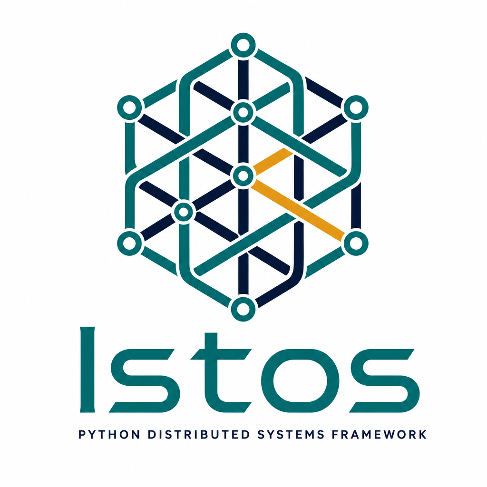

<p align="center">
  
</p>

# Istos

*Decorator-first Python services on [Eclipse Zenoh](https://zenoh.io/) (as a network backbone)— RPC, streaming, duplex channels, work queues, and durable pub/sub.*

**Istos** helps you ship **agile** distributed software and AI agents — code that stays **maintainable** and **scalable**, with a short **time to market** and a surface that is **easy to develop**, debug, and analyze (including with AI-assisted workflows). One small decorator API maps the network onto ordinary Python functions, so you wire RPC, streams, channels, jobs, and events without broker glue or framework sprawl standing between you and the product.

---


## Why Istos

Distributed systems get hard when the messaging layer eats your design budget. Istos keeps the architecture explicit: *services that answer requests*, *streams that yield*, *channels that converse*, *jobs that run once*, *events that fan out*. You draw the boxes and arrows; Istos **is** the arrows. A two-service prototype and a hundred-service fleet share the same mental model — just more decorators — so you can grow without rewriting how the team thinks about the system.

That is the agility story: **maintainability** from clear, bounded endpoints; **scalability** from the same fabric patterns at any size; **time to market** from `pip install`, decorate, `run()` — no cluster to stand up first; **ease of development** (and AI-friendly iteration) because each unit of work is a readable function on a key expression, not a maze of adapters.

---

## Key Features

- **Decorators first**: `@handle`, `@stream`, `@channel`, `@publish`, `@subscribe`.
- **Streaming RPC**: `@stream` yields chunks; `stream_query` / `@stream_client` consume them.
- **Duplex channels**: `@channel` + `open_channel` / `@channel_client` for multi-turn agents (WebSocket or fabric).
- **Work queues**: `@worker` / `@queue` / `enqueue` — one worker per job, leases with redelivery, retries, a dead-letter list, and workflow chains/chords. Brokerless, on the same fabric.
- **Scheduling**: `schedule(..., every_s=)` or `schedule(..., cron="0 0 * * *")` for periodic jobs.
- **HTTP gateway**: `Istos(http_port=8080)` plus `http=` / `ws=` — JSON, SSE, WebSocket. Co-host inside FastAPI with `istos.asgi.lifespan`. Optional MCP tools from `@handle`.
- **Smart selectors**: Query params like `?limit=5` land on your Python arguments.
- **Schema validation**: Type hints / Pydantic at the edge.
- **Retry policies**: `retry=5` (or a `RetryPolicy`) on queries and subscribers.
- **Brokerless durability**: `durable=True` replay caches; `persist="s3://…"` / `app.replay(...)` when the producer itself can die.
- **Security**: TLS/mTLS at the transport; `TokenAuthorizer` / `JWTAuthorizer` / `require_roles` on handlers. Default is still open — use `require_auth=True` when you mean it.
- **Pluggable storage**: in-memory, Redis, or SQLAlchemy (bring your async driver).
- **Architecture fitness**: `istos analyze` scores your own package on abstractness / instability / distance and flags dependency cycles and god-modules — keep the codebase right-sized as it grows.

## The Mental Model

- `**@handle` & `@query**`: 1-to-1 RPC
- `**@stream**`: 1-to-1 streaming RPC (SLM/LLM tokens)
- `**@channel**`: full-duplex sessions (agents)
- `**@publish` & `@subscribe**`: 1-to-many events
- `**@worker` & `enqueue**`: 1-of-N jobs, processed once (work queues)
- `**@on_liveliness**`: node discovery & health

## Installation

This project uses modern Python packaging via `[uv](https://github.com/astral-sh/uv)`.

```bash
# Standard installation
uv pip install istos

# Or install from source:
git clone https://github.com/0x416d6972/Istos.git
cd istos
uv pip install -e .

# Or with the optional backends (Redis, SQLAlchemy, S3 persistence, JWT, OTel):
uv pip install -e ".[all]"
```

## Quick Start

### 1. Registering a Handler

Handlers sit on the network and respond to incoming queries. Istos automatically parses query parameters into your function's arguments.

```python
from istos import Istos

istos = Istos()

@istos.handle(prefix="robot/move")
async def move(distance: int, speed: str = "normal"):
    """
    Called when a Zenoh Query hits 'robot/move'.
    E.g., Querying 'robot/move?distance=10&speed=fast' automatically binds:
    distance=10, speed='fast'
    """
    return {"status": "success", "distance": int(distance), "speed": speed}

if __name__ == "__main__":
    # Blocks and listens for queries
    istos.run()
```

### 2. Querying the Network

You can easily query handlers registered anywhere on the Zenoh network using `kwargs` to build Zenoh Selectors.

```python
from contextlib import asynccontextmanager
from istos import Istos

# Using @istos.query makes it a callable network function
@istos.query("robot/move")
async def query_robot(result):
    return result

# Queries run over the service's shared Zenoh session, so trigger them once the
# service is running — e.g. from a handler or a lifespan hook:
@asynccontextmanager
async def on_start(app):
    reply = await query_robot(distance=15, speed="fast")
    print(f"Robot replied: {reply}")
    yield

istos = Istos(lifespan=on_start)

if __name__ == "__main__":
    istos.run()
```

> There is no longer a per-call "transient session" fallback: the whole service
> shares **one** Zenoh session opened by `istos.run()`/`run_async()`. Calling a
> `@query`/`@publish` before the service is running raises a clear `RuntimeError`.

### 3. Publishing & Subscribing (Event-Driven)

React to real-time events efficiently.

```python
from istos import Istos

istos = Istos()

# --- Subscriber ---
@istos.subscribe("drone/telemetry")
def on_telemetry(data):
    # Triggered automatically when data is pushed to "drone/telemetry"
    print(f"Received telemetry via network: {data}")

# --- Publisher ---
@istos.publish("drone/telemetry")
def get_telemetry():
    # The return value is automatically published to the network!
    return {"battery": 85, "altitude": 120}

if __name__ == "__main__":
    # Call the wrapped publisher function to publish the result
    get_telemetry()
    
    # Or publish arbitrary data independently
    # await istos.publish_once("drone/telemetry", {"battery": 80})

    istos.run()
```

**Brokerless durability.** Add `durable=True` and a subscriber that joins *late*
still receives everything — replayed peer-to-peer from the producer's cache, with
no Kafka/NATS broker to run:

```python
@istos.publish("orders/created", durable=True, cache=1000)   # producer keeps a replay log
async def created(order): return order

@istos.subscribe("orders/created", durable=True, replay=1000)  # replays history + recovers
async def on_created(event): ...
```

The producer *is* the log (Zenoh advanced pub/sub); pair it with the idempotency
ledger for effectively-once processing. See [Brokerless Durable Messaging](docs/user-guide/durable-messaging.md).

**Work queues (jobs, not events).** An event fans out to *every* subscriber; a job
goes to *one* worker, gets acknowledged, and is redelivered if that worker dies. One
node owns the queue; workers compete for jobs from anywhere on the fabric:

```python
istos.queue("jobs/resize", max_attempts=3)    # this node owns the queue's state

@istos.worker("jobs/resize")                  # any node; return to ack, raise to retry
async def resize(job):
    await do_resize(job["path"])

# from anywhere on the mesh:
await istos.enqueue("jobs/resize", {"path": "/img/1.png"})
```

Leases reclaim jobs from dead workers, poison jobs land in a dead-letter list, and
`schedule("jobs/resize", {...}, cron="0 * * * *")` fires them periodically. See
[Work Queues](docs/user-guide/work-queues.md).

### 4. Liveliness Tracking (Heartbeats)

Detect when nodes connect or drop off the network without polling.

```python
# Announce that this node is alive on the network
istos.declare_liveliness("robot/camera1")

# Listen to the network for connection state changes
@istos.on_liveliness("robot/**")
def status_changed(key_expr: str, is_alive: bool):
    if is_alive:
        print(f"Node connected: {key_expr}")
    else:
        print(f"ALERT: Node crashed/disconnected -> {key_expr}")
```

### 5. One-Shot Commands & State Clearing

Use raw async functions when you want to act imperatively rather than relying on events.

```python
# Quickly shoot out a piece of data
await istos.publish_once("fast/data/pulse", {"system": "ok"})

# Clear/erase network states, especially useful if using persistent StoragePlugins
await istos.delete_once("robot/cache/old_logs")
```

### 6. High-Performance Shared Memory (Zero-Copy)

When sending large data arrays (like HD video frames) between handlers on the same hardware, enable POSIX shared memory allocations to avoid copies.

```python
@istos.publish("video/feed", use_shm=True)
def send_frame():
    return large_data_array

# The framework automatically manages Zenoh ShmProviders natively!
```

### 7. Dependency Injection & Pluggability

Set global defaults on startup, or override them per-endpoint for polyglot persistence and sagas:

```python
from istos import Istos
from istos.consistency import InMemoryStoragePlugin, SqlAlchemyStoragePlugin

istos = Istos(
    storage=InMemoryStoragePlugin(), # Global default
)
```

Each decorator can use its own serializer or storage plugin:

```python
from istos.messages.serialization import MsgPackSerializer

# JSON and Memory by default
@istos.handle("robot/move")
async def move(distance: int): ...

# MsgPack and a durable SQL ledger specifically for this endpoint
@istos.handle("sensor/data", serializer=MsgPackSerializer(),
              storage=SqlAlchemyStoragePlugin("postgresql+asyncpg://user:pass@db/istos"))
async def sensor(data): ...
```

**Dependency injection with `Depends`.** `@handle`, `@subscribe`, `@publish`, `@query`, and `@on_liveliness` can all declare dependencies that Istos resolves per invocation — plain callables, async callables, sub-dependencies, and `yield` dependencies with setup/teardown. Use it as a default value or inside `Annotated`:

```python
from typing import Annotated
from istos import Istos, Depends

istos = Istos()

async def get_db():
    conn = await open_conn()
    try:
        yield conn          # torn down after the handler replies
    finally:
        await conn.close()

@istos.handle("orders/create")
async def create(order_id: int, db: Annotated[Conn, Depends(get_db)]):
    return await db.insert(order_id)
```

Dependencies are cached per invocation (`use_cache=True` by default), sync dependencies are offloaded to a thread so they don't block the event loop, circular dependencies raise `DependencyCycleError`, and tests can swap any dependency via `istos.dependency_overrides[get_db] = fake_db`.

> **Streaming note:** on `@subscribe`/`@publish`, dependencies resolve **per message** — so a `yield` dependency opens/closes its resource on every message. For an expensive, long-lived resource (DB pool, sensor socket), create it once in the `lifespan` and inject the shared instance with a cheap `Depends` that just returns it; reserve per-message `yield` deps for genuinely per-message setup.

### 8. Retry Policies

Add automatic retries with exponential backoff to any query or subscriber. Pass a simple integer or a full `RetryPolicy` for fine-grained control.

```python
from istos.retry import RetryPolicy

# Simple — retry up to 5 times with default exponential backoff
@istos.query("weather/forecast", retry=5)
def get_forecast(result):
    return result

# Subscriber with retries — if processing crashes, it retries before giving up
@istos.subscribe("sensor/readings", retry=3)
def on_reading(data):
    save_to_database(data)  # retried automatically on transient failures

# Advanced — full control over backoff timing and failure handling
@istos.query("weather/forecast", retry=RetryPolicy(
    max_retries=10,
    delay=1.0,
    backoff_factor=3.0,
    on_failure=lambda e: print(f"Dead letter: {e}")
))
def get_forecast(result):
    return result
```

### 9. Schema Validation

Istos automatically validates and type-coerces incoming parameters at the network boundary — before your business logic runs. Supports three modes:

```python
from pydantic import BaseModel

# Mode 1: Type hints → auto-coercion
# Zenoh sends distance="15" (string), Istos casts it to int(15)
# Zenoh sends distance="hello" → rejected with a validation error reply
@istos.handle("robot/move")
async def move(distance: int, speed: str = "normal"):
    return {"moved": distance, "speed": speed}

# Mode 2: Pydantic BaseModel → full schema validation
class MoveRequest(BaseModel):
    distance: int
    speed: str = "normal"

@istos.handle("robot/move")
async def move(request: MoveRequest):
    # request is a fully validated Pydantic object with defaults applied
    return {"moved": request.distance}

# Mode 3: No type hints → passthrough (backward compatible)
@istos.handle("robot/echo")
async def echo(message):
    return {"echo": message}
```

### 10. Security: Transport, Authentication & Authorization

> [!WARNING]
> **Istos is unauthenticated by default.** With no configuration, a session runs
> in Zenoh **peer mode** with multicast scouting and no TLS — any peer on the
> local network can discover your node, invoke every `@handle`, and read every
> published value. Istos raises an `IstosSecurityWarning` (via `warnings.warn`,
> like urllib3's `InsecureRequestWarning`) whenever it opens such a session. You
> can escalate it to a hard failure in CI:
>
> ```python
> import warnings
> from istos import IstosSecurityWarning
> warnings.simplefilter("error", IstosSecurityWarning)  # insecure config -> exception
> ```
>
> Before deploying, do **both** of the following:
>
> 1. **Secure the transport** — authenticate and encrypt the fabric (below).
> 2. **Authorize handlers** — gate who may invoke them (further below).

#### Transport Security & Authentication

Secure the system without hard-coding secrets. `IstosZenohConfig` loads properties from your environment (`.env` file or environment variables) using `pydantic-settings`.

```env
# .env file
ISTOS_ZENOH_MODE=client
# Endpoints accept a JSON array or a comma-separated list:
ISTOS_ZENOH_CONNECT_ENDPOINTS=["tls/zenoh-router.local:7447"]
# ISTOS_ZENOH_CONNECT_ENDPOINTS=tls/router-a:7447,tls/router-b:7447

# Basic Auth
ISTOS_ZENOH_USERNAME=robot_1
ISTOS_ZENOH_PASSWORD=super_secret

# TLS / mTLS
ISTOS_ZENOH_ROOT_CA_CERTIFICATE=/path/to/ca.pem
# ISTOS_ZENOH_LISTEN_CERTIFICATE=/path/to/cert.pem
# ISTOS_ZENOH_LISTEN_PRIVATE_KEY=/path/to/key.pem
# ISTOS_ZENOH_ENABLE_MTLS=true

# Lock down discovery: disable UDP multicast scouting and rely on explicit endpoints
# ISTOS_ZENOH_MULTICAST_SCOUTING=false
```

`IstosZenohConfig` is a Pydantic `BaseSettings` model, so it validates **at construction** (via field/model validators) and fails fast on structurally broken security config (malformed endpoints, a TLS cert without its key, mTLS without a CA, an invalid `mode`), warns when credentials are configured without TLS, and rejects unknown `ISTOS_ZENOH_`* variables so a typo can't silently disable auth. Secrets (`password`, `listen_private_key`) are `SecretStr`, so they don't leak into logs or reprs. For knobs the builder doesn't model, deep-merge raw Zenoh config via `additional_config={...}`. Session managers also accept `open_retries`/`open_retry_delay_s` to wait out a router that isn't up yet at startup.

Then pass it straight to Istos — it builds the session for you:

```python
from istos import Istos
from istos.communication.sessions import IstosZenohConfig

# Auto-populates from .env!
config = IstosZenohConfig()

istos = Istos(config=config)
```

`config=` accepts an `IstosZenohConfig` (built via `.build()` at construction) or a raw `zenoh.Config`. It's mutually exclusive with `session_manager=` — pass one or the other. If you need a sync session or full control, wire it yourself instead:

```python
from istos.communication.sessions import AsyncZenohSession
istos = Istos(session_manager=AsyncZenohSession(config.build()))
```

#### Advanced Security: Vault & Secret Managers (Programmatic Raw PEM)

For zero-trust environments, Zenoh accepts **raw multiline PEM strings** natively, so you don't need to write files to disk. You can bypass `.env` and pull secrets into `IstosZenohConfig` at startup:

```python
# 1. Fetch from your secrets manager (HashiCorp Vault, AWS, LDAP, etc.)
secrets = vault.get_secret("istos/prod")

# 2. Inject raw strings directly into the config builder
config = IstosZenohConfig(
    mode="client",
    connect_endpoints=["tls/zenoh-router.local:7447"],
    username=secrets["zenoh_user"],
    password=secrets["zenoh_pass"],
    root_ca_certificate=secrets["raw_ca_pem_string"],  # raw multiline PEM
)

istos = Istos(session_manager=AsyncZenohSession(config.build()))
```

#### Authorization

Securing the transport controls *who joins the fabric*. **Authorization** controls *what a joined peer may invoke*. Istos gives every handler an authorization hook. An **authorizer** receives an `AuthContext` (the key expression, parameters, and any attachment/token the caller sent) and returns `True` to allow the request, or `False`/raises `UnauthorizedError` to deny it. Sync and async authorizers are both supported. Denied requests never reach your handler and are answered with an `unauthorized` error.

```python
from istos import Istos, TokenAuthorizer, AuthContext, UnauthorizedError

# App-wide: every handler (including built-in .istos/* endpoints) requires a token
istos = Istos(authorizer=TokenAuthorizer("super-secret-token"))

# Per-handler override — a custom rule for one endpoint
def admins_only(ctx: AuthContext) -> bool:
    return ctx.token in {"alice-key", "bob-key"}

@istos.handle("fleet/shutdown", authorizer=admins_only)
async def shutdown():
    return {"stopping": True}
```

Callers attach their token via `attachment=`:

```python
await istos.query_once("fleet/shutdown", attachment="alice-key")
```

> **Built-in endpoints** (`.istos/health`, `.istos/ready`, `.istos/metrics`) and
> `serve_docs()` inherit the app-wide authorizer. If you leave the app
> unauthenticated, Istos warns that these endpoints — including the AsyncAPI
> document that describes your entire API surface — are network-reachable by any
> peer. Set an `authorizer` (or pass one to `serve_docs(authorizer=...)`) to
> protect them.

#### A note on serialization

Istos ships `JsonSerializer` (default), `RawSerializer` (bytes/str passthrough for pre-encoded or binary payloads), `MsgPackSerializer`, `PydanticSerializer`, `ProtobufSerializer`, `YamlSerializer`, and a `Base64Serializer` wrapper. `JsonSerializer` tolerates common types like `datetime`, `Decimal`, and `UUID` (stringified), and `MsgPackSerializer` pins string decoding for cross-version consistency.

It does **not** ship a pickle-based serializer: `pickle.loads` executes arbitrary code embedded in its input, which on a fabric where any peer can publish to a key is remote code execution by design.

## Testing

Istos includes `IstosTestClient` for in-process testing without a Zenoh network:

```python
from istos import Istos
from istos.testing import IstosTestClient

istos = Istos()

@istos.handle("robot/move")
async def move(distance: int):
    return {"moved": distance}

client = IstosTestClient(istos)
result = await client.query("robot/move", distance=10)
```

Run the full test suite:

```bash
uv pip install -e ".[dev]"
pytest tests/ -m "not integration"   # unit tests
pytest tests/                         # includes network integration tests
```

## Production Features

- **Logging** — text or JSON under `istos.`*. We don't reconfigure your root logger unless you ask (`configure_logging=True` / `configure_logging()`).
- **Health** — `.istos/health` / `.istos/ready` (and `/livez` / `/readyz` with `http_port`)
- **Metrics** — `.istos/metrics` (and `/metrics`)
- **Capabilities** — `.istos/capabilities` lists handlers/streams with schemas
- **HTTP / SSE** — `http_port` + `http=` on handle/stream
- **Tracing** — optional OTel (`istos[otel]`)
- **Middleware** — correlation IDs, logging, your own
- **Exceptions** — `@exception_handler`
- **Shutdown** — SIGINT/SIGTERM
- **Storage** — Redis, SQLAlchemy, S3 persist, JWT extras

[Deployment](docs/user-guide/deployment.md) · [HTTP Gateway](docs/user-guide/http-gateway.md)

## CLI

```bash
istos new my-service    # Scaffold a new project
istos analyze           # Score component health (abstractness/instability/distance, cycles)
istos docs              # Serve documentation locally
istos version           # Print installed version
```

## Contributing

Contributions and pull requests are welcome! Ensure tests pass and type hints are satisfied.

1. Fork the repository
2. Create your feature branch (`git checkout -b feature/amazing-feature`)
3. Commit your changes
4. Push to the branch (`git push origin feature/amazing-feature`)
5. Open a Pull Request

---

**License**: Apache-2.0

**Python**: 3.10, 3.11, 3.12, 3.13, and 3.14