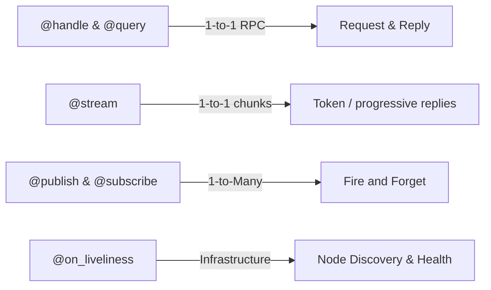

# Istos Documentation

!!! tip "Istos Framework"
    **A unified Python framework for building robust distributed systems and multi-agent applications over [Eclipse Zenoh](https://zenoh.io/).**

    
    
    

    Istos is a decorator-first framework for Eclipse Zenoh: RPC (`@handle` / `@query`), streaming RPC (`@stream`), pub/sub, liveliness, validation, dependency injection, durable messaging, HTTP/SSE ingress, and production ops (health, metrics, tracing, TLS, authz).

```bash
uv pip install istos
istos new my-service && cd my-service && python main.py
```

!!! warning "Unauthenticated by default"
    With no config, Istos runs in Zenoh **peer** mode with multicast scouting and no TLS — any local peer can invoke your handlers. For production, enable TLS, set an `authorizer`, and prefer `Istos(require_auth=True, authorizer=...)`. See [Security & TLS](user-guide/security.md) and [Authorization](user-guide/authorization.md).

## Who is this for?

| Use Istos when… | Prefer something else when… |
|-----------------|----------------------------|
| You build services or **agents/SLMs** on **Eclipse Zenoh** | You need Kafka/NATS as the **system of record** (infinite log / consumer groups) |
| You want brokerless pub/sub + RPC with Python decorators | You need a **REST-first monolith** as the whole product (use FastAPI for the public API; bridge to Istos via [`http_port`](user-guide/http-gateway.md)) |
| Peer-to-peer or router-mediated messaging is the integration style | Browser clients are the *only* consumers and you never need a fabric (still fine to expose Istos over HTTP/SSE) |

## The mental model



| Concept | Decorators / APIs | Role |
|---------|-------------------|------|
| RPC | `@handle`, `@query` | Request/reply |
| Streaming RPC | `@stream`, `stream_query` | Chunked replies (e.g. SLM tokens); optional HTTP SSE |
| Events | `@publish`, `@subscribe` | Fire-and-forget fan-out |
| Discovery | `@on_liveliness`, `declare_liveliness`, `.istos/capabilities` | Presence + tool manifest |
| Durability | `durable=True`, `persist="s3://…"`, storage plugins | Replay + producer-crash persist + idempotency |
| Northbound HTTP | `http_port`, `@handle(..., http=…)`, `@stream(..., http=…)` | JSON + SSE for FastAPI / browsers / probes |
| Cross-cutting | `Depends`, middleware, authorizer, `require_auth` | DI, authz, logging |

## Quick example

```python
from contextlib import asynccontextmanager
from istos import Istos

istos = Istos()

@istos.handle("robot/move")
async def move(distance: int, speed: str = "normal"):
    return {"status": "success", "distance": distance, "speed": speed}

@istos.subscribe("drone/telemetry")
async def on_telemetry(data):
    print(f"Received: {data}")

@istos.publish("drone/status")
async def broadcast_status():
    return {"status": "online", "uptime": 999}

@istos.query("robot/move")
async def query_move(result):
    return result

@asynccontextmanager
async def on_start(app):
    # Queries/publishes need an open session — use lifespan or another handler
    print(await query_move(distance=10, speed="fast"))
    await broadcast_status()
    yield

istos.lifespan = on_start

if __name__ == "__main__":
    istos.serve_docs(web_port=8080)  # AsyncAPI UI at http://localhost:8080
    istos.run()
```

## Learning path

### Tutorial track (start here)

1. [Installation](installation.md)
2. [Getting Started](user-guide/getting-started.md)
3. [Handlers & Queries (RPC)](user-guide/rpc.md) — includes `@stream`
4. [Publish & Subscribe](user-guide/pubsub.md)
5. [Brokerless Durable Messaging](user-guide/durable-messaging.md)
6. [HTTP Gateway & Probes](user-guide/http-gateway.md) — FastAPI / SSE / K8s probes
7. [Security & TLS](user-guide/security.md) · [Authorization](user-guide/authorization.md)
8. [Deployment](user-guide/deployment.md)

### Supporting guides

| Guide | Topics |
|-------|--------|
| [Capability discovery](user-guide/capabilities.md) | `.istos/capabilities`, tool manifests for agents |
| [Liveliness](user-guide/liveliness.md) | Node discovery & heartbeats |
| [Retry Policies](user-guide/retry.md) | Exponential backoff on query/subscribe |
| [Validation](user-guide/validation.md) | Type hints, Pydantic, passthrough |
| [Dependency Injection](user-guide/dependency-injection.md) | `Depends`, overrides, serializers, routers |
| [Application Databases](user-guide/application-databases.md) | Named SQLAlchemy DBs via `db_session` |
| [Middleware](user-guide/middleware.md) | Correlation IDs, custom stack, exceptions |
| [Observability](user-guide/observability.md) | Logging, health, metrics, capabilities, OpenTelemetry |
| [Storage](user-guide/storage.md) | In-memory, Redis, SQLAlchemy ledgers |
| [Testing](user-guide/testing.md) | `IstosTestClient` |
| [CLI](user-guide/cli.md) | `istos new`, `istos docs`, `istos version` |

### Recipes (copy-paste)

[All recipes](recipes/index.md) — RPC lifespan, pub/sub, durable orders, secure RPC, Redis, health, middleware, production bundle, scaffolding.

## Feature map

| Feature | Guide | API |
|---------|-------|-----|
| `@handle` / `@query` | [RPC](user-guide/rpc.md) | [Handler](api/core/handler.md), [Query](api/core/query.md) |
| `@stream` / `stream_query` | [RPC](user-guide/rpc.md) · [HTTP/SSE](user-guide/http-gateway.md) | [Stream](api/core/stream.md) |
| `@publish` / `@subscribe` | [Pub/Sub](user-guide/pubsub.md) | [Publish](api/core/publish.md), [Subscribe](api/core/subscribe.md) |
| Durable streams + S3 persist | [Durable messaging](user-guide/durable-messaging.md) | [Durable](api/communication/durable.md), [Persist](api/communication/persist.md) |
| Liveliness | [Liveliness](user-guide/liveliness.md) | [Liveliness](api/core/liveliness.md) |
| Capability discovery | [Capabilities](user-guide/capabilities.md) | [Istos](api/istos.md) (`export_capabilities`) |
| HTTP gateway / SSE / probes | [HTTP Gateway](user-guide/http-gateway.md) | [Istos](api/istos.md) |
| Validation | [Validation](user-guide/validation.md) | [Validation](api/core/validation.md) |
| Retry | [Retry](user-guide/retry.md) | [Retry](api/core/retry.md) |
| TLS / authz / `require_auth` | [Security](user-guide/security.md) · [Authorization](user-guide/authorization.md) | [Config](api/communication/config.md), [Authz](api/core/authz.md) |
| `Depends` | [DI](user-guide/dependency-injection.md) | [Depends](api/di/depends.md) |
| Middleware / errors | [Middleware](user-guide/middleware.md) | [Middleware](api/middleware/base.md), [Errors](api/core/errors.md) |
| Health / metrics / OTel | [Observability](user-guide/observability.md) | [Health](api/health.md), [Metrics](api/observability/metrics.md), [Tracing](api/observability/tracing.md) |
| Storage plugins | [Storage](user-guide/storage.md) | [Storage](api/consistency/storage.md) |
| App databases | [Application DBs](user-guide/application-databases.md) | [Databases](api/consistency/databases.md) |
| Serialization | [DI](user-guide/dependency-injection.md) | [Serialization](api/messages/serialization.md) |
| AsyncAPI docs | Getting Started | [AsyncAPI](api/core/asyncapi.md) |
| Routers | [DI](user-guide/dependency-injection.md) | [IstosRouter](api/router.md) |
| Test client | [Testing](user-guide/testing.md) | [TestClient](api/testing/testclient.md) |
| CLI | [CLI](user-guide/cli.md) | [CLI](api/cli.md) |

## Built-in network endpoints

When enabled on `Istos(...)`:

| Key | Purpose | Flag |
|-----|---------|------|
| `.istos/health` | Liveness | `enable_health=True` (default) |
| `.istos/ready` | Readiness + custom checks | `enable_health=True` |
| `.istos/metrics` | Prometheus text | `enable_metrics=True` |
| `.istos/capabilities` | Tool / handler manifest for agents | `enable_discovery=True` (default) |
| `.istos/docs` (+ HTTP UI) | AsyncAPI | `serve_docs(...)` |

With `Istos(http_port=…)` the same process also serves HTTP `GET /livez`, `/readyz`, `/metrics`, plus any `@handle(..., http=…)` and `@stream(..., http=…)` routes. See [HTTP Gateway](user-guide/http-gateway.md).

These Zenoh endpoints inherit the app-wide `authorizer`.

## Optional extras

```bash
uv pip install "istos[redis]"        # RedisStoragePlugin
uv pip install "istos[sqlalchemy]"   # SqlAlchemyStoragePlugin (+ your async driver)
uv pip install "istos[s3]"           # S3/MinIO persist for durable streams
uv pip install "istos[jwt]"          # JWTAuthorizer
uv pip install "istos[otel]"         # OpenTelemetry tracing
uv pip install "istos[all]"          # redis + sqlalchemy + s3 + jwt + otel
uv pip install "istos[dev]"          # pytest, mypy, mkdocs, …
```

## Production checklist

- [ ] `IstosZenohConfig` with TLS + auth (client mode + explicit endpoints)
- [ ] `Istos(require_auth=True, authorizer=…)` (or app-wide / per-handler authorizer)
- [ ] `json_logs=True`, health + metrics (+ OTel if needed)
- [ ] Durable ledger: Redis or SQLAlchemy for multi-process
- [ ] Prefer HTTP probes (`/livez`, `/readyz`) when `http_port` is set; else query `.istos/health` & `.istos/ready`
- [ ] Escalate `IstosSecurityWarning` in CI

Details: [Deployment](user-guide/deployment.md) · [Security](user-guide/security.md) · [Recipe: Production](recipes/production-service.md)

## API reference index

- **App:** [Istos](api/istos.md) · [IstosRouter](api/router.md) · [TestClient](api/testing/testclient.md) · [CLI](api/cli.md)
- **Core:** [Handler](api/core/handler.md) · [Query](api/core/query.md) · [Stream](api/core/stream.md) · [Publish](api/core/publish.md) · [Subscribe](api/core/subscribe.md) · [Liveliness](api/core/liveliness.md) · [Retry](api/core/retry.md) · [Validation](api/core/validation.md) · [AsyncAPI](api/core/asyncapi.md) · [Authz](api/core/authz.md) · [Errors](api/core/errors.md)
- **Communication:** [Sessions](api/communication/sessions.md) · [Zenoh Config](api/communication/config.md) · [Durable](api/communication/durable.md) · [Persist](api/communication/persist.md)
- **Consistency:** [Storage](api/consistency/storage.md) · [Redis](api/consistency/redis_storage.md) · [SQLAlchemy](api/consistency/sqlalchemy_storage.md) · [DB Config](api/consistency/config.md) · [DB Registry](api/consistency/databases.md)
- **Other:** [Serialization](api/messages/serialization.md) · [Depends](api/di/depends.md) · [Middleware](api/middleware/base.md) · [Context](api/context.md) · [Health](api/health.md) · [Logging](api/logging.md) · [Metrics](api/observability/metrics.md) · [Tracing](api/observability/tracing.md)

## Project links

- [Contributing](contributing.md) · [Changelog](changelog.md) · [License](license.md)
- Source: [github.com/A111ir/Istos](https://github.com/A111ir/Istos)
