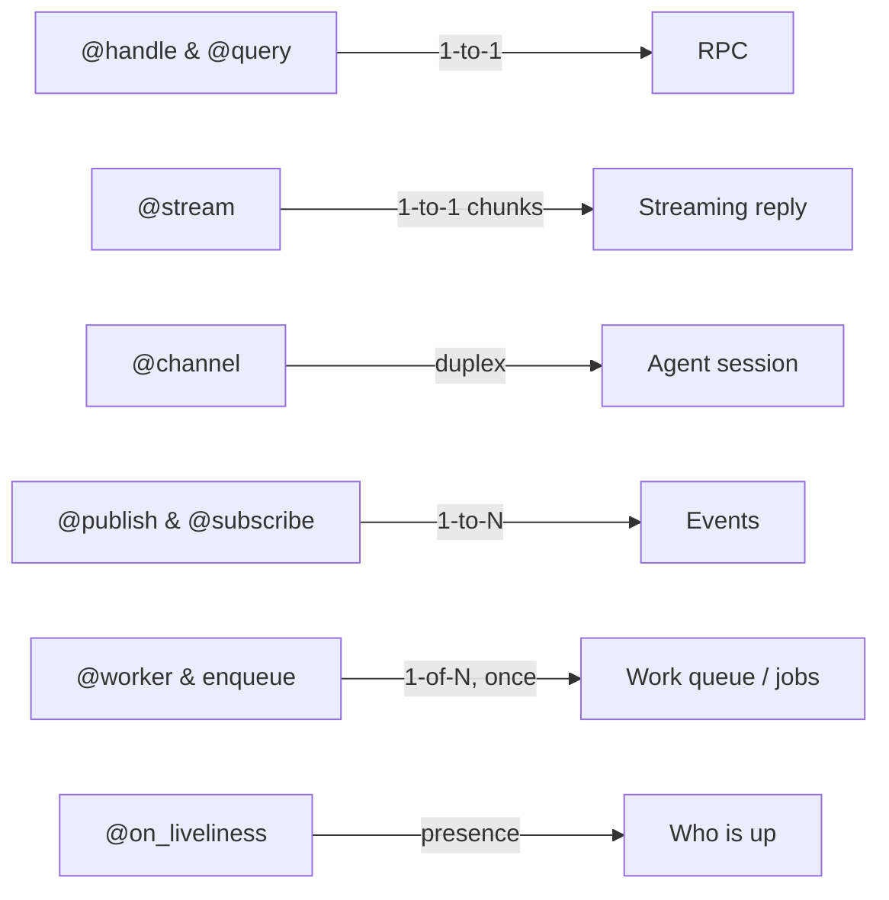

<p align="center">
  
</p>

# Istos Documentation

!!! tip "Istos Framework"
    **Decorator-first apps on [Eclipse Zenoh](https://zenoh.io/)** — RPC, streaming
    replies, duplex channels, pub/sub, durable messaging, work queues, and an
    optional HTTP / SSE / WebSocket / MCP surface.

    
    
    

```bash
uv pip install istos
istos new my-service && cd my-service && python main.py
```

!!! warning "Unauthenticated by default"
    Default config is Zenoh **peer** mode, multicast scouting, no TLS. Anyone on
    the local fabric can hit your handlers. Before production: TLS, an
    `authorizer`, and usually `require_auth=True`. See
    [Security](user-guide/security.md) and [Authorization](user-guide/authorization.md).

## Who is this for?

| Use Istos when… | Look elsewhere when… |
|-----------------|----------------------|
| Your services talk over Zenoh (edge, robotics, agents) | Kafka/NATS is the log you operate and keep forever |
| You want RPC + pub/sub in one Python process | The product *is* a REST API (put FastAPI in front; call Istos via [`http_port`](user-guide/http-gateway.md) if you still want the fabric) |
| Peer or router-mediated messaging fits | You only ever need HTTP and never a fabric |

## The mental model



| | Decorators | What it does |
|---|------------|--------------|
| RPC | `@handle`, `@query` | one request, one reply |
| Streaming RPC | `@stream`, `stream_query` | one request, many chunks (optional SSE) |
| Duplex | `@channel`, `open_channel` | interactive agent sessions (optional WebSocket) |
| Events | `@publish`, `@subscribe` | fire-and-forget |
| Work queues | `@worker`, `@queue`, `enqueue` | one worker per job, leases, retries, dead-letter |
| Scheduling | `schedule(..., every_s=/cron=)` | periodic jobs on an interval or cron |
| Discovery | liveliness + `.istos/capabilities` | who's up, what they expose |
| Durability | `durable=True`, `persist="s3://…"`, `replay()`, storage plugins | replay / survive crashes / idempotency |
| HTTP | `http_port`, `http=` / `ws=`, ASGI co-host, MCP | JSON + SSE + WebSocket + tools for outside callers |
| Glue | `Depends`, middleware, authorizer | the usual |

## Quick example

```python
from contextlib import asynccontextmanager
from istos import Istos

istos = Istos()

@istos.handle("robot/move")
async def move(distance: int, speed: str = "normal"):
    return {"status": "success", "distance": distance, "speed": speed}

@istos.subscribe("drone/telemetry")
async def on_telemetry(data):
    print(f"Received: {data}")

@istos.publish("drone/status")
async def broadcast_status():
    return {"status": "online", "uptime": 999}

@istos.query("robot/move")
async def query_move(result):
    return result

@asynccontextmanager
async def on_start(app):
    # Need an open session — lifespan or another handler
    print(await query_move(distance=10, speed="fast"))
    await broadcast_status()
    yield

istos.lifespan = on_start

if __name__ == "__main__":
    istos.serve_docs(web_port=8080)  # AsyncAPI UI
    istos.run()
```

## Learning path

1. [Installation](installation.md)
2. [Getting Started](user-guide/getting-started.md)
3. [RPC](user-guide/rpc.md) (`@handle` / `@query` / `@stream`)
4. [Pub/Sub](user-guide/pubsub.md)
5. [Work queues](user-guide/work-queues.md) (`@worker` / `@queue` / `enqueue`)
6. [Durable messaging](user-guide/durable-messaging.md)
7. [HTTP gateway](user-guide/http-gateway.md)
8. [Security](user-guide/security.md) · [Authorization](user-guide/authorization.md)
9. [Deployment](user-guide/deployment.md)

Other guides: [capabilities](user-guide/capabilities.md), [liveliness](user-guide/liveliness.md),
[retry](user-guide/retry.md), [validation](user-guide/validation.md),
[DI](user-guide/dependency-injection.md), [databases](user-guide/application-databases.md),
[middleware](user-guide/middleware.md), [observability](user-guide/observability.md),
[storage](user-guide/storage.md), [architecture health](user-guide/architecture-health.md),
[testing](user-guide/testing.md), [CLI](user-guide/cli.md).

[Recipes](recipes/index.md) if you want copy-paste starters.

## Feature map

| Feature | Guide | API |
|---------|-------|-----|
| `@handle` / `@query` | [RPC](user-guide/rpc.md) | [Handler](api/primitives/handler.md), [Query](api/primitives/query.md) |
| `@stream` | [RPC](user-guide/rpc.md), [HTTP](user-guide/http-gateway.md) | [Stream](api/primitives/stream.md) |
| `@channel` / `open_channel` | [Channels](user-guide/channels.md) | [Channel](api/primitives/channel.md) |
| `@publish` / `@subscribe` | [Pub/Sub](user-guide/pubsub.md) | [Publish](api/primitives/publish.md), [Subscribe](api/primitives/subscribe.md) |
| `@worker` / `@queue` / `enqueue` (leases, DLQ, chords) | [Work Queues](user-guide/work-queues.md) | [Work Queue](api/queue/index.md) |
| `schedule(every_s=/cron=)` | [Work Queues](user-guide/work-queues.md) | [Work Queue](api/queue/index.md) |
| Durable + S3 persist / `replay()` | [Durable messaging](user-guide/durable-messaging.md) | [Durable](api/communication/durable.md), [Persist](api/communication/persist.md) |
| Liveliness | [Liveliness](user-guide/liveliness.md) | [Liveliness](api/primitives/liveliness.md) |
| Capabilities | [Capabilities](user-guide/capabilities.md) | [Istos](api/istos.md) |
| HTTP / SSE / WS / MCP / ASGI | [HTTP Gateway](user-guide/http-gateway.md), [MCP](user-guide/mcp.md) | [Istos](api/istos.md), [ASGI](api/http/asgi.md), [MCP](api/http/mcp.md) |
| Validation | [Validation](user-guide/validation.md) | [Validation](api/validation.md) |
| Retry | [Retry](user-guide/retry.md) | [Retry](api/retry.md) |
| TLS / authz | [Security](user-guide/security.md), [Authorization](user-guide/authorization.md) | [Config](api/communication/config.md), [Authz](api/security/authz.md) |
| `Depends` | [DI](user-guide/dependency-injection.md) | [Depends](api/di/depends.md) |
| Middleware / errors | [Middleware](user-guide/middleware.md) | [Middleware](api/middleware/base.md), [Errors](api/errors.md) |
| Health / metrics / OTel | [Observability](user-guide/observability.md) | [Health](api/http/health.md), [Metrics](api/observability/metrics.md), [Tracing](api/observability/tracing.md) |
| Storage plugins | [Storage](user-guide/storage.md) | [Storage](api/consistency/storage.md) |
| App databases | [Application DBs](user-guide/application-databases.md) | [Databases](api/consistency/databases.md) |
| Serialization | [DI](user-guide/dependency-injection.md) | [Serialization](api/messages/serialization.md) |
| AsyncAPI | Getting Started | [AsyncAPI](api/discovery/asyncapi.md) |
| Routers | [DI](user-guide/dependency-injection.md) | [IstosRouter](api/router.md) |
| Test client | [Testing](user-guide/testing.md) | [TestClient](api/testing/testclient.md) |
| Architecture fitness (`istos analyze`) | [Architecture Health](user-guide/architecture-health.md) | [Fitness](api/fitness.md) |
| CLI | [CLI](user-guide/cli.md) | [CLI](api/cli.md) |

## Built-in endpoints

| Key | Purpose | Flag |
|-----|---------|------|
| `.istos/health` | liveness | `enable_health=True` |
| `.istos/ready` | readiness | `enable_health=True` |
| `.istos/metrics` | Prometheus text | `enable_metrics=True` |
| `.istos/capabilities` | what this node exposes | `enable_discovery=True` |
| `.istos/docs` | AsyncAPI | `serve_docs(...)` |

With `http_port` set you also get `GET /livez`, `/readyz`, `/metrics`, plus any
`http=` routes. See [HTTP Gateway](user-guide/http-gateway.md).

Built-ins inherit the app-wide `authorizer`.

## Optional extras

```bash
uv pip install "istos[redis]"
uv pip install "istos[sqlalchemy]"   # + your async driver
uv pip install "istos[s3]"           # persist streams to S3/MinIO
uv pip install "istos[jwt]"
uv pip install "istos[otel]"
uv pip install "istos[all]"          # redis + sqlalchemy + s3 + jwt + otel
uv pip install "istos[dev]"
```

## Before you ship

- [ ] TLS + Zenoh credentials (`mode=client`, explicit endpoints)
- [ ] `require_auth=True` and an `authorizer` (or deliberate `Public` opt-outs)
- [ ] `json_logs=True`; health + metrics (OTel if you use it)
- [ ] Redis or SQLAlchemy ledger if you run more than one process
- [ ] HTTP probes (`/livez`, `/readyz`) when `http_port` is set
- [ ] Treat `IstosSecurityWarning` as an error in CI

More: [Deployment](user-guide/deployment.md) · [Security](user-guide/security.md) ·
[Production recipe](recipes/production-service.md)

## API index

- **App:** [Istos](api/istos.md) · [Router](api/router.md) · [TestClient](api/testing/testclient.md) · [CLI](api/cli.md) · [Fitness](api/fitness.md)
- **Core:** [Handler](api/primitives/handler.md) · [Query](api/primitives/query.md) · [Stream](api/primitives/stream.md) · [Channel](api/primitives/channel.md) · [Publish](api/primitives/publish.md) · [Subscribe](api/primitives/subscribe.md) · [Work Queue](api/queue/index.md) · [Liveliness](api/primitives/liveliness.md) · [Retry](api/retry.md) · [Validation](api/validation.md) · [AsyncAPI](api/discovery/asyncapi.md) · [Authz](api/security/authz.md) · [Errors](api/errors.md) · [SessionStore](api/primitives/session_store.md)
- **Communication:** [Sessions](api/communication/sessions.md) · [Config](api/communication/config.md) · [Durable](api/communication/durable.md) · [Persist](api/communication/persist.md)
- **Consistency:** [Storage](api/consistency/storage.md) · [Redis](api/consistency/redis_storage.md) · [SQLAlchemy](api/consistency/sqlalchemy_storage.md) · [DB Config](api/consistency/config.md) · [Registry](api/consistency/databases.md)
- **Other:** [Serialization](api/messages/serialization.md) · [Depends](api/di/depends.md) · [Middleware](api/middleware/base.md) · [Context](api/context.md) · [Health](api/http/health.md) · [Logging](api/logging.md) · [Metrics](api/observability/metrics.md) · [Tracing](api/observability/tracing.md) · [ASGI](api/http/asgi.md) · [MCP](api/http/mcp.md) · [Gateway](api/http/gateway.md)

## Links

- [Contributing](contributing.md) · [Changelog](changelog.md) · [License](license.md)
- [github.com/0x416d6972/Istos](https://github.com/0x416d6972/Istos)
