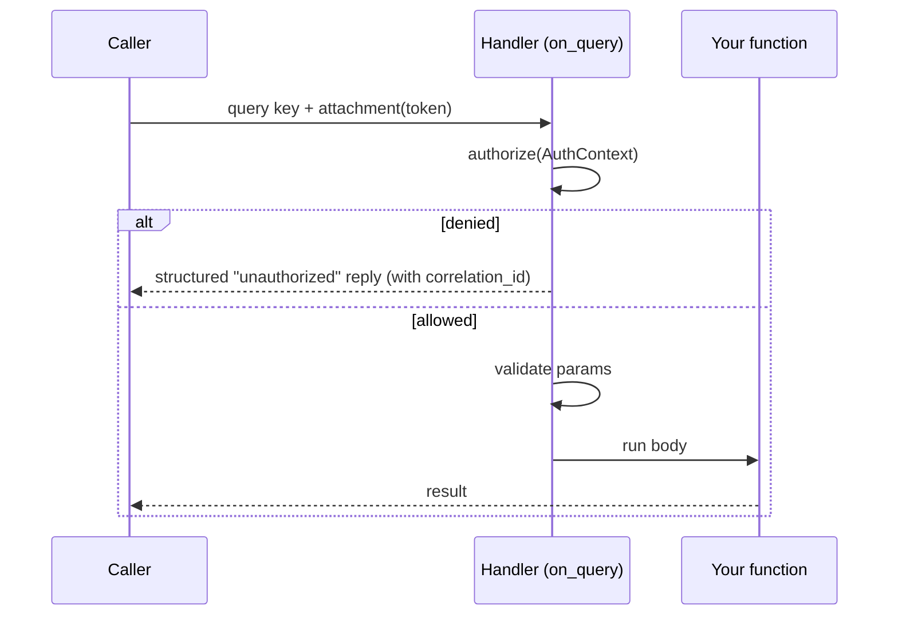

# Authorization

Istos has **two independent security layers**, and it is worth being precise about
which is which — they solve different problems and are configured in different
places.

| | **Authentication** | **Authorization** |
|---|---|---|
| Question it answers | *Who may join the fabric?* | *What may a joined peer invoke?* |
| Configured with | [`IstosZenohConfig`](security.md) — username/password, TLS, mTLS | `authorizer=` — on `Istos(...)` or a decorator |
| Enforced by | **Zenoh**, at the transport, before any Istos code runs | **Istos**, per request, inside the handler pipeline |
| Credential | Zenoh username / client certificate | an application token in the request **attachment** |
| Scope | the whole session / link | per key-expression / per handler |

Authentication is covered on the [Security & TLS](security.md) page. **This page is
about the second layer: the `authorizer`.**

!!! warning "The two layers do not know about each other"
    A peer's Zenoh username or mTLS certificate is **not** visible to an authorizer.
    Authorization sees only the token the caller re-sends in the request attachment.
    Use them together — TLS + credentials keep strangers off the fabric; the
    authorizer decides what an admitted peer may call. Neither substitutes for the
    other.

---

## The mental model

An **authorizer** is any callable that receives an [`AuthContext`](#the-authcontext)
and returns a truthy value to **allow** or a falsy value (or raises
`UnauthorizedError`) to **deny**. Both sync and async are supported.

```python
from istos import AuthContext, UnauthorizedError

def admins_only(ctx: AuthContext) -> bool:
    return ctx.token in {"alice-key", "bob-key"}     # truthy = allow

async def require_role(ctx: AuthContext) -> bool:
    if ctx.token is None:
        raise UnauthorizedError("missing token")     # raising = deny
    return await lookup_role(ctx.token) == "operator"
```

This is the same **guard / policy-callback** pattern you know from FastAPI
dependencies, Django permission classes, gRPC interceptors, or Envoy `ext_authz`.

### Where it runs

Authorization is a **network-boundary** concern. It fires in `on_query`, **before**
parameter validation and before your handler body:



A denied request never reaches your function and never touches validation — the
caller gets a **structured error reply** (`code: "unauthorized"`) carrying the
request's `correlation_id`, and the denial is logged. It is not a silent drop.

!!! note "Subscribers are gated too"
    The same layered authorizer runs on `@subscribe` before the callback body: the
    app-wide gate and a per-subscriber `authorizer=` both check the incoming
    **sample's attachment**. Because pub/sub has no reply channel, a denied sample
    is **logged and dropped** (not answered with an error). `Public` and
    `Depends(current_principal)` work on subscribers exactly as on handlers.

!!! note "In-process calls bypass authorization"
    The `TestClient` and calling a `@query` decorator locally go through the
    in-process path (`__call__`), not `on_query`, so **no authorizer runs**. Local
    calls are already inside your trust boundary; authorization guards the *network*
    edge. Drive a request through the query path if you want to exercise the gate.

---

## The `AuthContext`

Every authorizer receives one, describing the incoming request:

| Field | Type | Meaning |
|---|---|---|
| `prefix` | `str` | The handler's registered key expression. |
| `key_expr` | `str` | The actual key that was queried (useful with wildcards). |
| `params` | `dict` | Parsed selector parameters (`?robot_id=7` → `{"robot_id": "7"}`). |
| `attachment` | `bytes \| None` | Raw bytes the caller attached to the request. |
| `.token` | `str \| None` | Auth credential from the attachment via [`RequestEnvelope`](../api/context.md): a **bare UTF-8 string** is treated as the token; a JSON object `{"tok","cid","tp"}` carries token + correlation/trace. `None` if absent or undecodable. |

Because the context carries `prefix`, `key_expr`, and `params`, you can authorize on
**what** is being touched (attribute/resource-based), not only on **who** is calling.

!!! info "The token is not the Zenoh username"
    `ctx.token` is an **application-level** credential that the caller ships in the
    Zenoh attachment — analogous to an `Authorization: Bearer <token>` header. It is
    unrelated to the Zenoh username/password from `IstosZenohConfig`. Send it with
    `query_once` / `@query(..., attachment=…)` / `publish_once(..., attachment=…)`,
    or over HTTP via `Authorization: Bearer` on the [gateway](http-gateway.md):

    ```python
    await client.query_once("fleet/status", attachment="super-secret-token")

    @client.query("fleet/status", attachment="super-secret-token")
    async def status(result):
        return result
    ```

---

## Fail-closed: `require_auth=True`

By default Istos allows unauthenticated construction (with an
`IstosSecurityWarning` on insecure transport). For production meshes, refuse to
start without an app-wide authorizer:

```python
from istos import Istos, JWTAuthorizer, IstosSecurityError

# Raises IstosSecurityError at construction — no silent open mesh:
istos = Istos(
    require_auth=True,
    authorizer=JWTAuthorizer(secret=os.environ["JWT_SECRET"]),
)
```

Use `Public` on individual handlers to opt specific endpoints out of the
app-wide gate while keeping `require_auth` for everything else.

---

## Layered resolution: app-wide **and** per-handler

Istos resolves a handler's effective authorizer by **layering**, exactly like a
global middleware plus a per-route guard:

| Handler `authorizer=` | App-wide set? | Effective behavior |
|---|---|---|
| *(unset)* | yes | **Inherit** the app-wide authorizer. |
| *(unset)* | no | Open to any peer on the fabric. |
| a callable | yes | **Both** the app-wide **and** the handler authorizer must pass. |
| a callable | no | Only the handler authorizer applies. |
| `Public` | either | **Bypass** the app-wide gate for this one handler. |

The key property: a per-handler rule can only ever **tighten** access, never
silently loosen it. To open a single handler under an otherwise-protected app you
must say so explicitly with `Public`.

```python
from istos import Istos, TokenAuthorizer, AuthContext, Public

istos = Istos(authorizer=TokenAuthorizer("app-token"))     # baseline everywhere

@istos.handle("fleet/status")                              # inherits the baseline
async def status():
    return {"ok": True}

def admins_only(ctx: AuthContext) -> bool:
    return ctx.params.get("role") == "admin"

@istos.handle("fleet/shutdown", authorizer=admins_only)    # baseline AND admins_only
async def shutdown(role: str):
    return {"stopping": True}

@istos.handle("health/ping", authorizer=Public)            # explicitly public
async def ping():
    return {"pong": True}
```

For `fleet/shutdown` a request is allowed only when it carries a valid `app-token`
(app-wide layer) **and** presents `role=admin` (handler layer). Missing either one is
a denial.

---

## `TokenAuthorizer` — the shared-secret gate

The built-in `TokenAuthorizer` allows a request only when its token matches one of an
accepted set. This is the classic **service-to-service API key** pattern.

```python
from istos import Istos, TokenAuthorizer

istos = Istos(authorizer=TokenAuthorizer("super-secret-token"))

# Rotate keys with zero downtime by accepting old and new during rollover:
istos = Istos(authorizer=TokenAuthorizer({"old-token", "new-token"}))
```

!!! warning "A shared secret is not user identity"
    `TokenAuthorizer` is a bearer secret — no signature, expiry, or scopes. It is
    right for authenticating *services*, not for authenticating *users*. For real
    identity, use `JWTAuthorizer` (below).

---

## `JWTAuthorizer` — verified identity + roles

For real user identity — signed, expiring, role-carrying tokens — use the
built-in `JWTAuthorizer` (the `istos[jwt]` extra, backed by PyJWT). It verifies
the token from the request attachment and maps it to a [`Principal`](#resolving-an-identity-the-principal):

```python
import os
from istos import Istos, JWTAuthorizer

# HS256 shared secret:
istos = Istos(authorizer=JWTAuthorizer(secret=os.environ["JWT_SECRET"]))

# RS256 with an identity provider's public key + audience/issuer checks:
istos = Istos(authorizer=JWTAuthorizer(
    public_key=PUBLIC_KEY_PEM,
    algorithms=["RS256"],
    audience="my-api",
    issuer="https://idp.example.com",
))
```

It verifies the signature and `exp` (plus `aud`/`iss` when configured), then
builds `Principal(id=<sub>, roles=<roles claim>, claims=<full payload>)`. The
`none` algorithm is always rejected. An absent, malformed, expired, or
wrong-audience token is denied (**401**). Tune the claim mapping with
`id_claim=` (default `sub`), `roles_claim=` (default `roles`; a space/comma
string like an OAuth2 `scope` is split into a set), `leeway=`, and
`require_exp=`.

## `require_roles` — role-based authorization (RBAC)

Authenticate app-wide, then guard individual handlers with the roles they need.
`require_roles` reads the `Principal` the authenticator resolved and checks its
roles:

```python
from istos import Istos, JWTAuthorizer, require_roles, Principal, Depends, current_principal

istos = Istos(authorizer=JWTAuthorizer(secret=SECRET))   # authenticate everything

@istos.handle("fleet/status")                            # any authenticated caller
async def status(): ...

@istos.handle("fleet/reset", authorizer=require_roles("admin"))
async def reset(user: Principal = Depends(current_principal)):
    return {"reset_by": user.id}

@istos.handle("fleet/ops", authorizer=require_roles("admin", "operator", mode="any"))
async def ops(): ...
```

`mode="all"` (default) requires every listed role; `mode="any"` requires at least
one. The semantics follow HTTP: **no authenticated identity → 401**, **identity
without the role → 403**. This is the [layered](#layered-resolution-app-wide-and-per-handler)
model — the app-wide authenticator and the per-handler role guard both run.

If a handler needs auth *without* an app-wide authenticator, pass one inline:

```python
@istos.handle("admin/op",
              authorizer=require_roles("admin", authenticator=JWTAuthorizer(secret=SECRET)))
async def op(): ...
```

Combined with the [HTTP gateway](http-gateway.md), this all works over HTTP too:
the `Authorization: Bearer <jwt>` header is forwarded as the token, so
`JWTAuthorizer` + `require_roles` gate HTTP callers exactly as they gate Zenoh peers.

---

## Custom authorizers

Because an authorizer is just a callable, you can express any policy.

**Role-based (RBAC)** — verify the token and check a role:

```python
async def require_operator(ctx: AuthContext) -> bool:
    if ctx.token is None:
        raise UnauthorizedError("missing token")
    role = await lookup_role(ctx.token)          # DB / cache / JWT decode
    return role in {"operator", "admin"}

@istos.handle("fleet/shutdown", authorizer=require_operator)
async def shutdown(): ...
```

**Attribute/resource-based (ABAC)** — authorize on the request's target:

```python
def owns_resource(ctx: AuthContext) -> bool:
    caller = ctx.token                           # e.g. "robot-7"
    target = ctx.params.get("robot_id")          # from ?robot_id=...
    return caller == target or ctx.prefix.startswith("public/")

@istos.handle("fleet/robot", authorizer=owns_resource)
async def robot_cmd(robot_id: str): ...
```

When you combine a custom authorizer with an app-wide one, remember they **layer**:
the app-wide authorizer typically *authenticates* the caller and the per-handler
authorizer *authorizes* what that authenticated caller may do.

---

## Resolving an identity: the principal

The gate answers **"is this request allowed?"**. Often it also, along the way, works
out **"who is this?"** — it decoded a token, looked up a role, verified a JWT. Throwing
that identity away and re-deriving it in the handler body is wasteful. So an authorizer
may *return* the identity instead of a bare `True`:

> **Any non-`bool` truthy value an authorizer returns is treated as the principal.**
> `True` still means "allowed, no identity"; a falsy value (or a raised
> `UnauthorizedError`) still denies.

Istos stashes that principal on the request context, and you inject it into the handler
body with `Depends(current_principal)` — the gate resolves identity once, the body reuses
it:

```python
from istos import Istos, Principal, AuthContext, Depends, current_principal

async def authenticate(ctx: AuthContext) -> Principal:
    if ctx.token is None:
        raise UnauthorizedError("missing token")
    claims = await verify_jwt(ctx.token)              # your identity source
    return Principal(id=claims["sub"], roles=frozenset(claims["roles"]))

istos = Istos(authorizer=authenticate)

@istos.handle("fleet/status")
async def status(user: Principal = Depends(current_principal)) -> dict:
    # `user` is the exact object `authenticate` returned — no re-parsing.
    return {"requested_by": user.id, "is_admin": user.has_role("admin")}
```

`Principal` is a default shape (`id`, `roles`, `claims`) with a `has_role()`
helper — but the contract is structural, so you can return **your own** user object and
inject it the same way. It's just "whatever truthy thing the authorizer returned."

### The gate decides, DI materializes

This is the clean division of labour that makes the authorizer *not* redundant with DI:

| Concern | Tool | When it runs |
|---|---|---|
| **allow / deny** (+ resolve identity) | the `authorizer` | at the network boundary, *before* params are parsed |
| **use the identity** in your logic | `Depends(current_principal)` | in the handler body, *after* the gate allowed the request |

You do **not** put the allow/deny decision in a `Depends` — that would run after untrusted
input is parsed, can't gate the built-in endpoints, and fires on in-process calls too.
Keep the decision in the authorizer; use DI only to *consume* what it resolved.

Related injectables (all from `istos`):

- `current_principal()` → the identity, or `None` if the request was allowed without one.
- `current_token()` → the raw attachment decoded as a UTF-8 string, or `None`.
- `current_request()` → the full `RequestContext` (correlation id, prefix, principal, …).

**Layered identity.** When both an app-wide and a per-handler authorizer run, the
**per-handler** principal wins if it returns one, otherwise the app-wide principal is used —
so a handler-specific policy can refine *who* the caller is, not just *whether* they pass.

!!! warning "In-process calls have no principal"
    `current_principal()` returns `None` under `TestClient` and local `@query` calls, because
    the network gate never runs. When a handler under test needs an identity, override it:
    `app.dependency_overrides[current_principal] = lambda: Principal(id="test-user")`.

---

## Protecting the built-in endpoints

`.istos/health`, `.istos/ready`, `.istos/metrics`, and `serve_docs()` are ordinary
handlers, so they inherit the **app-wide** authorizer — which is the only way to gate
them, since you don't register them yourself.

```python
istos = Istos(authorizer=TokenAuthorizer("ops-token"))   # gates health/ready/metrics

# A docs-specific authorizer layers on top of the app-wide one:
istos.serve_docs(web_port=8080, authorizer=TokenAuthorizer("docs-token"))
```

Istos emits an `IstosSecurityWarning` if you enable health/metrics or `serve_docs()`
with no authorizer at all — the docs endpoint in particular broadcasts your entire
API surface to every peer.

---

## Guarantees — and honest limits

- **Layered, never silently loosened.** App-wide and per-handler authorizers both
  apply; a per-handler rule can only add requirements. Opening a handler under an app
  gate requires an explicit `Public`.
- **Denials are structured, not silent.** A denied request gets an `unauthorized`
  error reply with the request's `correlation_id`, and the event is logged.
- **Authorization is an application layer, not transport.** It runs *after* a peer is
  already on the fabric. Always pair it with TLS + Zenoh credentials — an open,
  unencrypted transport with a great authorizer is still wide open at the link level.
- **The token is a bearer credential in the attachment.** With `TokenAuthorizer` it
  is an unsigned shared secret (API-key style). For signed, expiring, role-carrying
  identity use the built-in [`JWTAuthorizer`](#jwtauthorizer--verified-identity--roles)
  (`istos[jwt]`), not a hand-rolled custom decoder unless you need a special IdP.
- **One credential per request.** The attachment carries a single token, so you can
  authenticate-then-authorize on one identity, but you cannot layer two *independent*
  shared secrets on the same request.
- **The network edge only.** In-process and `TestClient` calls are not authorized by
  design.

## Next Steps

- [Security & TLS](security.md) — transport authentication and encryption
- [Handlers & Queries (RPC)](rpc.md) — `query_once`, attachments, the request pipeline
- [Recipe: Secure RPC](../recipes/secure-rpc.md)
