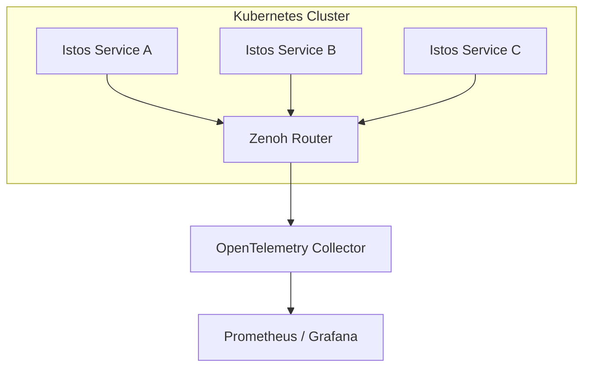

# Deployment Guide

This guide covers running Istos services in production with Zenoh routers, containers, and observability.

## Architecture



## Quick Start with Docker Compose

```bash
# Start Zenoh router + Redis + Postgres
docker compose up -d zenoh-router redis postgres

# Run your service locally, connected to the router
export ISTOS_ZENOH_MODE=client
export ISTOS_ZENOH_CONNECT_ENDPOINTS='["tcp/127.0.0.1:7447"]'
python main.py
```

## Production Configuration

```python
from istos import Istos
from istos.communication.sessions import AsyncZenohSession, IstosZenohConfig
from istos.consistency import RedisStoragePlugin

config = IstosZenohConfig(
    mode="client",
    connect_endpoints=["tls/zenoh-router.prod:7447"],
)

istos = Istos(
    session_manager=AsyncZenohSession(config.build()),
    storage=RedisStoragePlugin(url="redis://redis.prod:6379/0"),
    log_level="INFO",
    json_logs=True,
    enable_health=True,
    enable_metrics=True,
    enable_tracing=True,
    tracing_endpoint="http://otel-collector:4317",
    service_name="robot-fleet",
)
```

## Health Checks

Istos registers built-in Zenoh query handlers:

| Endpoint | Purpose |
|----------|---------|
| `.istos/health` | Liveness — process is alive |
| `.istos/ready` | Readiness — service is ready to accept traffic |
| `.istos/metrics` | Prometheus-format metrics |
| `.istos/capabilities` | Tool / handler manifest (when `enable_discovery=True`) |

Query from any node on the network:

```python
health = await istos.query_once(".istos/health")
ready = await istos.query_once(".istos/ready")
```

When `Istos(http_port=8080)` is set you also get plain HTTP probes (no Zenoh
client needed on the kubelet side):

| Path | Purpose |
|------|---------|
| `GET /livez`, `GET /healthz` | liveness |
| `GET /readyz` | readiness (503 if not ready) |
| `GET /metrics` | Prometheus |

See [HTTP Gateway](http-gateway.md).

### Custom Readiness Checks

```python
async def check_database():
    # Return {"status": "ok"} when healthy
    return {"status": "ok", "connections": 5}

istos.add_health_check("database", check_database)
```

## Graceful Shutdown

Istos handles `SIGINT` and `SIGTERM` automatically:

1. Stops accepting new work
2. Marks readiness as `not_ready`
3. Unbinds all Zenoh handlers and subscribers
4. Closes the session cleanly

In Kubernetes, configure a `preStop` hook with adequate `terminationGracePeriodSeconds` (30s recommended).

## Observability

### Structured Logging

```python
istos = Istos(log_level="INFO", json_logs=True)
```

Logs are emitted as JSON for aggregation by ELK, Loki, or Datadog.

### Prometheus Metrics

Query `.istos/metrics` or access the in-process collector:

```python
print(istos.metrics.export_prometheus())
```

### OpenTelemetry Tracing

```bash
pip install 'istos[otel]'
```

```python
istos = Istos(
    enable_tracing=True,
    tracing_endpoint="http://localhost:4317",
    service_name="my-service",
)
```

## Storage Backends

| Plugin | Use Case | Install |
|--------|----------|---------|
| `InMemoryStoragePlugin` | Development, testing | Built-in |
| `RedisStoragePlugin` | Distributed, fast | `pip install 'istos[redis]'` |
| `SqlAlchemyStoragePlugin` | Any SQL database (Postgres, MySQL, ...); you choose the async driver via the URL | `pip install 'istos[sqlalchemy]'` + your driver |

`SqlAlchemyStoragePlugin` targets any SQLAlchemy-supported database — bring your own
async driver in the URL, e.g. `postgresql+asyncpg://…`, `postgresql+psycopg://…`, or
`mysql+asyncmy://…`:

```python
from istos.consistency import SqlAlchemyStoragePlugin

storage = SqlAlchemyStoragePlugin("postgresql+asyncpg://user:pass@db:5432/istos")
```

## Kubernetes Example

```yaml
apiVersion: apps/v1
kind: Deployment
metadata:
  name: istos-robot-service
spec:
  replicas: 3
  template:
    spec:
      containers:
        - name: robot-service
          image: my-registry/istos-robot:latest
          env:
            - name: ISTOS_ZENOH_MODE
              value: "client"
            - name: ISTOS_ZENOH_CONNECT_ENDPOINTS
              value: '["tcp/zenoh-router:7447"]'
          ports:
            - containerPort: 8080
              name: http
          # With Istos(http_port=8080):
          livenessProbe:
            httpGet:
              path: /livez
              port: http
            initialDelaySeconds: 10
            periodSeconds: 30
          readinessProbe:
            httpGet:
              path: /readyz
              port: http
            initialDelaySeconds: 5
            periodSeconds: 10
```

!!! note "No HTTP port?"
    Fall back to an `exec` probe that runs `query_once('.istos/health')`. Works,
    just clumsier than `/livez`.

## Security Checklist

- [ ] TLS on router connections
- [ ] Zenoh username/password or mTLS
- [ ] `require_auth=True` + an authorizer (or conscious `Public` opt-outs)
- [ ] Secrets not on disk as PEM files if you can help it
- [ ] Non-root containers
- [ ] Network policy: Zenoh port (+ HTTP if you opened a gateway)

See [Security & TLS](security.md).

## Related guides

- [Observability](observability.md) — logging, health, metrics, tracing
- [Storage](storage.md) — Redis and SQLAlchemy ledgers
- [CLI](cli.md) — `istos new` / `istos docs`
- [Recipe: Production service](../recipes/production-service.md)
