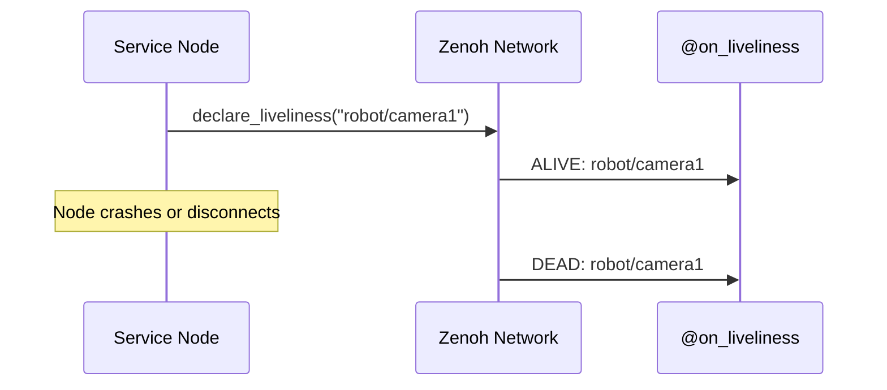

# Liveliness Tracking

The `@on_liveliness` decorator provides **Infrastructure Awareness** — instant detection of when nodes connect to or disconnect from the network, without polling.

## How It Works

Zenoh's liveliness protocol uses lightweight tokens and subscriptions to track node presence in real-time:



## Declaring Liveliness

Announce that your service is alive on the network:

```python
from istos import Istos

istos = Istos()

# Declare this node as alive
istos.declare_liveliness("robot/camera1")
```

The token remains active as long as the Zenoh session is open. When the session closes (or the process crashes), the network automatically notifies all liveliness subscribers.

## Monitoring Liveliness

React to node connection and disconnection events:

```python
@istos.on_liveliness("robot/**")
def status_changed(key_expr: str, is_alive: bool):
    if is_alive:
        print(f"✅ Node connected: {key_expr}")
    else:
        print(f"❌ Node disconnected: {key_expr}")
```

### Wildcard Patterns

| Pattern | Matches |
|---------|---------|
| `robot/**` | Any key under `robot/` (any depth) |
| `robot/*` | Direct children of `robot/` only |
| `robot/camera*` | Keys starting with `robot/camera` |

## Use Cases

### Fleet Monitoring

```python
istos.declare_liveliness("fleet/drone/alpha")

@istos.on_liveliness("fleet/**")
def fleet_monitor(key_expr: str, is_alive: bool):
    drone_id = key_expr.split("/")[-1]
    if not is_alive:
        print(f"🚨 Drone {drone_id} lost! Initiating recovery...")
```

### Service Health Dashboard

```python
active_services = set()

@istos.on_liveliness("services/**")
def track_services(key_expr: str, is_alive: bool):
    if is_alive:
        active_services.add(key_expr)
    else:
        active_services.discard(key_expr)
    print(f"Active services: {len(active_services)}")
```

!!! tip "No Polling Required"
    Unlike HTTP health checks, Zenoh liveliness is event-driven. You get notified instantly when a node joins or leaves — no polling intervals, no wasted bandwidth.

## Next Steps

- [Observability](observability.md) — `.istos/health` / `.istos/ready`
- [Security & TLS](security.md)
- [API: Liveliness](../api/core/liveliness.md)
