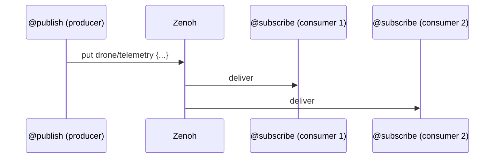

# Publish & Subscribe

`@publish` and `@subscribe` are the two halves of **fire-and-forget, 1-to-many**
messaging — event streaming. Like RPC, it rides directly on Zenoh with no broker,
but unlike RPC the producer never waits for a reply and any number of consumers
react independently.

- **`@publish` is the producer.** A function's return value is serialized and sent
  to everyone subscribed to its key expression.
- **`@subscribe` is the consumer.** A function runs every time data arrives on a
  matching key expression.

## How it works



By default this is **at-most-once**: a consumer that is offline when a message is
sent simply misses it. For replay and recovery, see
[Brokerless Durable Messaging](durable-messaging.md).

---

## `@publish` — the producer

```python
import asyncio
from istos import Istos

app = Istos()

@app.publish("drone/status")
def status():
    # The return value is published to everyone on drone/status.
    return {"status": "online", "uptime": 999}
```

Calling the wrapper computes the function, serializes the result, and puts it on the
fabric. **The wrapper is async — you must `await` it:**

```python
@app.publish("drone/telemetry")
def telemetry():
    return {"battery": 85, "altitude": 120}

async def loop():
    while True:
        await telemetry()          # <-- await; a sync body runs off-thread internally
        await asyncio.sleep(1.0)
```

### Options

| Option | Default | Meaning |
|---|---|---|
| `prefix` | — | Key expression to publish on. |
| `serializer` | `JsonSerializer()` | Wire format. `MsgPackSerializer()` for binary. Must match subscribers. |
| `use_shm` | `False` | Zero-copy [shared memory](#high-performance-shared-memory) (same host only). |
| `durable` | `False` | Publish through an AdvancedPublisher with a replay cache — see [Durable Messaging](durable-messaging.md). |
| `cache` / `heartbeat` | `1000` / `1.0` | Durable-only: replay depth and gap-detection heartbeat. |
| `reliability` / `congestion_control` | `None` | Durable-only overrides (default `RELIABLE` + `BLOCK`). |

`durable=True` and `use_shm=True` cannot be combined.

### Dependencies

Publishers support `Depends(...)` too — leading positional args are your call
arguments, the rest are resolved per publish:

```python
@app.publish("orders/created")
async def created(order: dict, db=Depends(get_db)):
    await db.save(order)
    return order
```

---

## `@subscribe` — the consumer

```python
@app.subscribe("drone/telemetry")
def on_telemetry(data):
    # Called automatically on every message.
    print(f"Battery: {data['battery']}%")
```

The subscriber deserializes the incoming payload and passes it as the first argument.

### Options

| Option | Default | Meaning |
|---|---|---|
| `prefix` | — | Key expression (wildcards allowed) to listen on. |
| `serializer` | `JsonSerializer()` | How to decode the payload. Must match the publisher. |
| `retry` | `None` | Retries the callback on failure (`int` or `RetryPolicy`). |
| `durable` | `False` | Subscribe via an AdvancedSubscriber with history + recovery — see [Durable Messaging](durable-messaging.md). |
| `replay` / `recover` | `1000` / `True` | Durable-only: history depth on join, and gap recovery. |
| `on_miss` | `None` | Durable-only: `on_miss(source, nb)` on an **unrecoverable** gap. |

### The payload is validated at the boundary

A subscriber's message is untrusted network input, so — just like `@handle`'s params
— the payload is **validated and coerced against the first parameter's type hint**
before your code runs. Annotate it with a pydantic model and you receive a real,
validated instance:

```python
from pydantic import BaseModel

class Telemetry(BaseModel):
    battery: float
    altitude: int

@app.subscribe("drone/telemetry")
def on_telemetry(data: Telemetry):      # data is a validated Telemetry instance
    if data.battery < 20:
        alert("low battery")
```

Scalar hints are coerced too (`data: int` turns `"42"` into `42`). A payload that
fails validation raises `SchemaValidationError`; on the live subscriber path that
error is logged and the bad event is dropped (there is no reply channel to return it
on). Leave the parameter **untyped** to opt out and receive the raw deserialized
value:

```python
@app.subscribe("raw/data")
def on_raw(data):                       # no hint → raw dict, no validation
    ...
```

### Dependencies

The payload fills the first positional slot; `Depends(...)` params are resolved per
message:

```python
@app.subscribe("orders/created")
async def on_created(event, db=Depends(get_db)):
    await db.record(event)
```

### Wildcard patterns

```python
@app.subscribe("drone/*/telemetry")
def on_any_drone(data):
    # matches drone/alpha/telemetry, drone/beta/telemetry, ...
    ...
```

### Retry

If the callback raises, `retry` re-runs it with exponential backoff. A callback that
still fails after its retries is logged (it never crashes the subscriber loop):

```python
@app.subscribe("payments/events", retry=3)
async def on_payment(event):
    await downstream.forward(event)     # transient failures are retried
```

---

## Durable pub/sub

Add `durable=True` to both ends to get replay for late joiners and recovery after a
disconnect — the producer becomes its own bounded log, peer-to-peer, still no broker.
Full details, guarantees, and honest limits are in
[Brokerless Durable Messaging](durable-messaging.md).

```python
@app.publish("orders/created", durable=True, cache=1000)
async def created(order: dict):
    return order

@app.subscribe("orders/created", durable=True, replay=1000,
               on_miss=lambda source, nb: alert(f"lost {nb} from {source}"))
async def on_created(event: dict):
    await process(event)
```

---

## High-performance: shared memory

For large payloads (video frames, tensors) between processes on the **same host**,
enable zero-copy shared memory:

```python
@app.publish("video/feed", use_shm=True)
def send_frame():
    return large_numpy_array            # Istos manages the Zenoh ShmProvider
```

!!! warning "Same host only"
    Shared memory works only between processes on one machine. Cross-network traffic
    falls back to standard Zenoh transport automatically. `use_shm` cannot be combined
    with `durable`.

---

## Imperative actions (no decorator)

| Call | What it does |
|---|---|
| `await app.publish_once(prefix, data, use_shm=…, serializer=…)` | One-shot fire-and-forget put (the non-durable path). |
| `await app.delete_once(prefix)` | Network-wide DELETE on a key expression. |

```python
await app.publish_once("drone/telemetry", {"battery": 80})
await app.delete_once("robot/cache/old_logs")
```

---

## Guarantees — and honest limits

- **Publishers are async — always `await` them.** Calling `telemetry()` without
  `await` just builds a coroutine and publishes nothing.
- **At-most-once by default.** An offline consumer misses messages. Use `durable=True`
  for replay/recovery.
- **A typed payload that fails validation is dropped.** On the live path the
  `SchemaValidationError` is logged (pub/sub has no reply channel). Leave the param
  untyped to accept anything.
- **Serializers must match.** A JSON publisher and a MsgPack subscriber won't decode.
- **The session must be running.** Calling a `@publish` / `publish_once` before
  `app.run()` / `run_async()` raises `RuntimeError`. Publish from a lifespan hook, a
  handler, or after the session is open.

## Authorizing subscribers

`@subscribe(..., authorizer=…)` drops samples that fail the gate (no NACK —
pub/sub has nowhere to reply). Attach a token with `publish_once(..., token=…)`
or via the request envelope when publishing from an authorized handler. Details
in [Authorization](authorization.md).

## Next Steps

- [Brokerless Durable Messaging](durable-messaging.md)
- [Handlers & Queries (RPC)](rpc.md)
- [Retry Policies](retry.md)
- [Recipe: Pub/Sub telemetry](../recipes/pubsub-telemetry.md)
</content>
