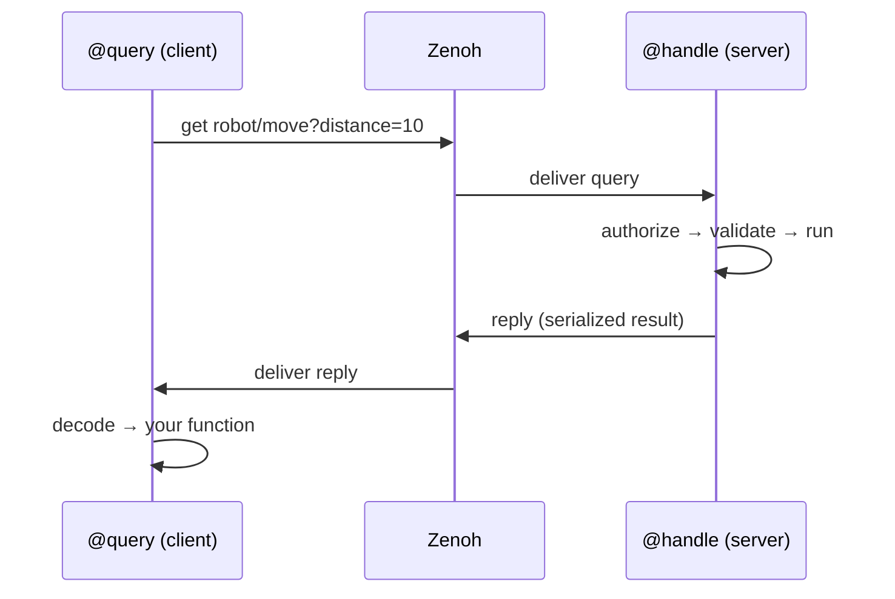

# Handlers & Queries (RPC)

`@handle` and `@query` are the two halves of **request/reply** — the RPC backbone
of Istos. They sit on Zenoh's **query/reply** primitive (distinct from the pub/sub
one), so there is no broker in the middle:

- **`@handle` is the server.** It declares a *queryable* at a key expression and
  answers requests.
- **`@query` is the client.** It issues a *get* to that key expression and
  processes the reply.

The address is the `prefix` (a Zenoh key expression like `robot/move`). Call
parameters ride in the **selector**: `robot/move?distance=10;speed=fast`.

## How it works



The key asymmetry: a `@handle` function **is** the business logic (its params come
from the network, its return goes back on the wire). A `@query` function is a
**callback that receives the reply** — the network params come from the *call
site's* keyword arguments. Same prefix, opposite directions.

---

## `@handle` — the server

```python
from istos import Istos

app = Istos()

@app.handle("robot/move")
async def move(distance: int, speed: str = "normal") -> dict:
    return {"moved": distance, "speed": speed}
```

When a request arrives, the handler runs a fixed pipeline:

1. **Parse** params out of the selector (`?distance=10;speed=fast`).
2. **Authorize** — if an `authorizer` is set, it is checked *first*, at the network
   boundary, using the request's attachment (auth token). Unauthorized ⇒ error
   reply, and your function never runs.
3. **Validate & coerce** params against your function signature with pydantic
   (`"10"` → `int 10`). Framework-injected params (`db`, `Depends`) are excluded.
   Bad input ⇒ structured error reply.
4. **Execute** — idempotency check → dependency resolution → middleware → retry →
   your function.
5. **Reply** the serialized return value.

### Options

| Option | Default | Meaning |
|---|---|---|
| `prefix` | — | Key expression this handler answers on (its network address). |
| `serializer` | `JsonSerializer()` | Wire format for params-in / result-out. Use `MsgPackSerializer()` for binary. Must match the caller. |
| `retry` | `None` | `int` (→ N retries with backoff) or a `RetryPolicy`. Wraps *execution* — see [Retry](#retry-two-independent-layers). |
| `durability` | `"at_most_once"` | Delivery/processing semantics against the app storage ledger — see below. |
| `authorizer` | app-wide | Per-handler auth gate; overrides `Istos(authorizer=...)`. Unset ⇒ any peer can call it. |

### Inferred from the function signature

A lot of behavior comes from the function you decorate, not from decorator
arguments — FastAPI-style:

```python
from pydantic import BaseModel
from istos.consistency import StoragePlugin
from istos.di import Depends

class MoveRequest(BaseModel):
    distance: int
    speed: str = "normal"

@app.handle("robot/move")
async def move(
    request: MoveRequest,               # typed → validated & coerced from the wire
    db: StoragePlugin = None,           # → app storage auto-injected
    tracer=Depends(get_tracer),         # → resolved per request (with yield teardown)
) -> dict:                              # return hint → result validated before reply
    ...
```

- **Typed params** are validated and coerced at the network boundary.
- **`db: StoragePlugin`** receives the app-wide storage backend.
- **`Depends(...)`** params are resolved per request; `yield` dependencies are torn
  down after the reply.
- The **return type hint** validates the result before it goes on the wire.

### Wildcard selectors

A handler can answer a pattern and read the concrete key it matched:

```python
@app.handle("robot/*/status")
async def status(key_expr: str):        # key_expr = the actual matched key
    component = key_expr.split("/")[1]  # "arm", "camera", ...
    return {"component": component, "status": "ok"}
```

### `durability` — three levels

Durability writes go to the app-wide storage ledger
(`Istos(storage=...)` / `storage_config=` / `storage_database=`).

| Level | Behavior |
|---|---|
| `at_most_once` *(default)* | Fire-and-forget. No storage writes. Fastest. |
| `at_least_once` | Every call is appended to the storage **event log** (keyed by a hash of prefix + params). Survives restarts; retries may duplicate. |
| `exactly_once` | Before running, `check_processed(key)` — if seen, the **cached result is returned without re-executing**. After running, `mark_processed` + log. |

```python
@app.handle("payments/charge", durability="exactly_once")
async def charge(order_id: str, amount: int, db: StoragePlugin = None):
    return {"charged": amount}
```

This is idempotency of *processing*, complementary to the durable *transport* in
[Durable Messaging](durable-messaging.md).

### `authorizer` — the auth gate

```python
from istos.security.authz import TokenAuthorizer

@app.handle("admin/reset", authorizer=TokenAuthorizer("s3cret"))
async def reset(): ...
```

Auth is enforced at the network boundary, *before* validation and execution, using
the request's **attachment** as the token. In-process calls (the `TestClient`) skip
the network gate. See [Security & TLS](security.md).

---

## `@query` — the client

```python
@app.query("robot/move")
async def request_move(result):     # result = the decoded reply
    return result
```

The decorated function is a **post-processor of the reply**, not the source of the
params. Calling it works like this:

1. **Call kwargs become selector params** — `request_move(distance=10)` →
   `robot/move?distance=10`. Those kwargs are consumed (not passed to your function).
2. Run the Zenoh **get** with `timeout_s` (on a background thread).
3. Collect the successful replies and **decode** each with the serializer.
4. **Cardinality**: exactly one reply ⇒ the decoded value is passed; **more than
   one** reply (several peers answered the same key) ⇒ a **list** is passed; **zero**
   replies (timeout) ⇒ an **empty list** `[]`.
5. Your function is called with that data as its first argument; its return value is
   what the `@query` call returns.
6. The whole get-and-process is wrapped in `retry`.

### Options

| Option | Default | Meaning |
|---|---|---|
| `prefix` | — | Key expression to query — must match a handler's `prefix`. |
| `timeout_s` | `5.0` | How long to wait for replies. After that, whatever arrived is returned. |
| `retry` | `None` | Retries the entire query + decode + post-process on **exception**. |
| `serializer` | `JsonSerializer()` | How to decode the reply. Must match the handler's output format. |

```python
@app.query("math/add", retry=3, timeout_s=2.0)
def process(result):            # result = the handler's reply, already decoded
    return result["sum"] * 10

total = await process(a=2, b=3) # a,b → selector; reply → process()
```

---

## Imperative actions (no decorator)

For one-off calls where a decorator is overkill:

| Call | What it does |
|---|---|
| `await app.query_once(key, timeout_s=…, serializer=…, token=…, **params)` | One-shot get. `**params` → selector. Returns the decoded reply (single), a list (many), or `[]` (none). `token=` carries an auth token to a protected handler. |
| `await app.delete_once(prefix)` | Network-wide DELETE on a key expression (tombstone / clear a stored value). |

```python
result = await app.query_once("math/add", a=2, b=3)          # {"sum": 5}
await app.query_once("admin/reset", token="s3cret")          # authorized call
```

!!! note "Auth tokens on `@query`"
    Pass `token=` on `@query(...)` or `query_once(...)` to call a
    `TokenAuthorizer`-protected handler. Same kwarg on `stream_query`,
    `open_channel`, and `publish_once`.

---

## When the handler fails

A handler that raises does not send you an exception — there is a network in
between. It replies with an `ErrorResponse` **payload**, which on the wire is an
ordinary dict:

```json
{"error": "not_found", "code": "not_found", "message": "no such client",
 "correlation_id": "…"}
```

`query_once` and `@query` notice that envelope and raise it back at you, so the
failure cannot be mistaken for an answer:

```python
from istos import NotFoundError

try:
    client = await app.query_once("clients/get", id="acme")
except NotFoundError:
    return None
```

The `code` round-trips back to the class the responder raised — `NotFoundError`,
`UnauthorizedError`, `ForbiddenError`, `RateLimitError` — and anything else
arrives as `IstosError` keeping its `code`. The `correlation_id` comes with it, so
your traceback can be matched to the responder's log line.

!!! warning "Why this matters more than it looks"

    Before 0.1.3 the envelope was returned as data, and the resulting bug is very
    hard to see:

    ```python
    reply = await app.query_once("clients/list")
    clients = (reply or {}).get("clients") or []   # [] for an error envelope
    ```

    An error envelope answers `.get()` like any other dict, so an outage becomes
    an empty list — indistinguishable from "there are none". A UI showing an
    empty table is ambiguous; an agent *saying* "there are no clients registered"
    while the database refuses connections is a confident lie.

If you decode a reply yourself, `is_error_payload(reply)` and
`error_from_payload(reply)` are exported from `istos`.

**A multi-reply query is not covered by this.** Several responders on one key
decode to a list, and one of them failing is not the call failing — the list keeps
whatever each one said, error envelopes included. Check them yourself:

```python
replies = await app.query_once("*/health")   # many responders
alive = [r for r in replies if not is_error_payload(r)]
```

---

## Retry — two independent layers

The same `RetryPolicy` (N attempts, exponential backoff `delay * factor ** attempt`)
is used on both ends, but it wraps **different things**:

| | `@handle` retry | `@query` retry |
|---|---|---|
| **Wraps** | your handler's *execution* | the *network get + decode + post-process* |
| **Fires when** | your logic raises (transient DB error, a downstream call fails) | the call over the network raises (decode error, callback error) |
| **Runs on** | the server (callee) | the client (caller) |

Neither retries an error that cannot change: a `not_found` or `unauthorized` fails
immediately rather than spending the backoff budget to be told the same thing
again. A `rate_limit_exceeded` *does* retry — waiting is the remedy — as do 5xx
and transport faults. `istos.is_retryable(exc)` is the rule if you need it.

They compose: a client can re-query after a failure while the server independently
retries its own logic. And with `durability="exactly_once"`, a client re-query with
identical params hits `check_processed` on the server and returns the **cached**
result — so client retry + exactly-once server does not double-execute side effects.

---

## Guarantees — and honest limits

- **A handler that returns `None` sends no reply.** The caller waits out its
  `timeout_s` and receives an empty list `[]`. Return a value (even `{"ok": True}`)
  if the client needs a reply.
- **A timeout is not an exception.** Zero replies decode to `[]`, so `@query`'s
  `retry` does **not** re-fire on "no handler answered". Check for an empty result
  yourself if a missing handler must be treated as a failure. (A handler that
  answered *and failed* does raise, and `retry` re-fires only if the error could
  plausibly go away — see below.)
- **An error is recognised by a discriminator**, not by the transport: a reply is
  an error iff it carries `__istos_error: true`. Istos stamps it on every envelope.
  If a handler's *success* value legitimately carries `error`/`code`/`message`,
  stamp `__istos_error: false` (or return `reply_err(...)` for the failure path)
  and it will be read as data. When the field is absent — an older responder — the
  legacy rule applies: a dict carrying all three of `error`, `code` and `message`
  is treated as an error.
- **Serializers must match on both ends.** A JSON handler and a MsgPack query will
  fail to decode. Set the same `serializer=` on the pair.
- **Two nodes on the *same* key do not fan out — one of them answers, and which
  one is not yours to choose.** `@handle` declares its queryable `complete=True`
  (this node can answer the whole key by itself), so Zenoh asks exactly one, and
  the default reply consolidation would collapse same-key replies anyway. This is
  the right behavior for a key with one owner, and a trap if you expected every
  node to reply: the others are not slow, they are never asked. Do not run the
  same key on several nodes as a fan-out mechanism.
- **Fan-out is a wildcard over *distinct* keys, with consolidation off.**
  `a/health` and `b/health` are different queryables, so
  `app.query_once("*/health", consolidate_replies=False)` reaches both and returns
  a list. The flag matters: Zenoh consolidates replies by default and will drop
  some of them even though they answered on different keys, so a sweep without it
  can quietly return a subset. Each reply in the list may be an error envelope
  (see above).

---

## Combining handle & query

=== "Service A (server)"

    ```python
    from istos import Istos
    from pydantic import BaseModel

    app = Istos()

    class SensorRequest(BaseModel):
        sensor_id: str

    @app.handle("sensors/read")
    async def read_sensor(request: SensorRequest) -> dict:
        return {"temperature": 22.5, "humidity": 65.0}

    if __name__ == "__main__":
        app.run()
    ```

=== "Service B (client)"

    ```python
    from contextlib import asynccontextmanager
    from istos import Istos

    @asynccontextmanager
    async def on_start(app):
        # Queries run over the shared session — issue them once it is open.
        result = await app.query_once("sensors/read", sensor_id="temp_01")
        print(f"Temperature: {result['temperature']}°C")
        yield

    app = Istos(lifespan=on_start)

    if __name__ == "__main__":
        app.run()
    ```

    > The service shares **one** Zenoh session opened by `app.run()`. Calling a
    > `@query` / `query_once` before the session is running raises `RuntimeError`.

## Streaming RPC (token / chunk streaming)

A normal `@handle` replies once. For incremental output — SLM/LLM tokens, progress
updates, large paginated results — use `@stream`: an **async generator** whose
each `yield` is delivered to the caller as a chunk, over a single query.

```python
@app.stream("llm/generate")
async def generate(prompt: str):
    async for token in model.stream(prompt):
        yield token          # each yield → one chunk on the wire
```

Consume it with `stream_query`, which yields chunks **as they arrive**:

```python
async for token in app.stream_query("llm/generate", prompt="hello"):
    print(token, end="", flush=True)
```

- Same gate as `@handle`: authorization, validation, DI, and the request envelope
  (correlation/trace) all apply. The dependency scope stays open for the whole
  stream, so a `yield` dependency tears down after the last chunk.
- `stream_query` defaults to `timeout_s=60` (tuned for long inference) and
  forwards auth via `token=`.
- If the handler raises mid-stream, chunks already sent are delivered and then
  `stream_query` raises — so consumers see partial output followed by the error.

Under the hood this is a Zenoh multi-reply queryable read with
`consolidation=NONE`, so chunks stream incrementally rather than being buffered.
Middleware wraps the stream **once** at open and once at close (not per chunk);
authorization still runs on the first reply path. If the consumer breaks out of
`async for` early, `stream_query` cancels the underlying Zenoh get.

For the client decorator form (`@stream_client`), duplex agents (`@channel`),
and resumable sessions, see [Channels & Agent Sessions](channels.md).

## Next Steps

- [Channels & Agent Sessions](channels.md) — `@channel`, `open_channel`, SessionStore
- [Schema Validation](validation.md) — the validation/coercion layer
- [Retry Policies](retry.md)
- [Security & TLS](security.md) — authorize handlers
- [Publish & Subscribe](pubsub.md)
- [Recipe: RPC with lifespan](../recipes/rpc-lifespan.md)
