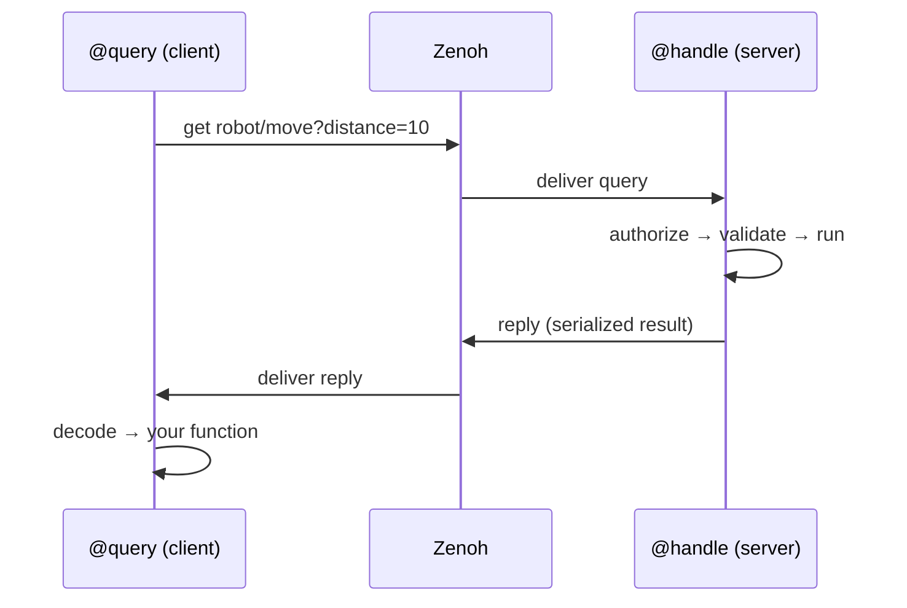

# Handlers & Queries (RPC)

`@handle` and `@query` are the two halves of **request/reply** — the RPC backbone
of Istos. They sit on Zenoh's **query/reply** primitive (distinct from the pub/sub
one), so there is no broker in the middle:

- **`@handle` is the server.** It declares a *queryable* at a key expression and
  answers requests.
- **`@query` is the client.** It issues a *get* to that key expression and
  processes the reply.

The address is the `prefix` (a Zenoh key expression like `robot/move`). Call
parameters ride in the **selector**: `robot/move?distance=10;speed=fast`.

## How it works



The key asymmetry: a `@handle` function **is** the business logic (its params come
from the network, its return goes back on the wire). A `@query` function is a
**callback that receives the reply** — the network params come from the *call
site's* keyword arguments. Same prefix, opposite directions.

---

## `@handle` — the server

```python
from istos import Istos

app = Istos()

@app.handle("robot/move")
async def move(distance: int, speed: str = "normal") -> dict:
    return {"moved": distance, "speed": speed}
```

When a request arrives, the handler runs a fixed pipeline:

1. **Parse** params out of the selector (`?distance=10;speed=fast`).
2. **Authorize** — if an `authorizer` is set, it is checked *first*, at the network
   boundary, using the request's attachment (auth token). Unauthorized ⇒ error
   reply, and your function never runs.
3. **Validate & coerce** params against your function signature with pydantic
   (`"10"` → `int 10`). Framework-injected params (`db`, `Depends`) are excluded.
   Bad input ⇒ structured error reply.
4. **Execute** — idempotency check → dependency resolution → middleware → retry →
   your function.
5. **Reply** the serialized return value.

### Options

| Option | Default | Meaning |
|---|---|---|
| `prefix` | — | Key expression this handler answers on (its network address). |
| `serializer` | `JsonSerializer()` | Wire format for params-in / result-out. Use `MsgPackSerializer()` for binary. Must match the caller. |
| `retry` | `None` | `int` (→ N retries with backoff) or a `RetryPolicy`. Wraps *execution* — see [Retry](#retry-two-independent-layers). |
| `durability` | `"at_most_once"` | Delivery/processing semantics against the app storage ledger — see below. |
| `authorizer` | app-wide | Per-handler auth gate; overrides `Istos(authorizer=...)`. Unset ⇒ any peer can call it. |

### Inferred from the function signature

A lot of behavior comes from the function you decorate, not from decorator
arguments — FastAPI-style:

```python
from pydantic import BaseModel
from istos.consistency import StoragePlugin
from istos.di import Depends

class MoveRequest(BaseModel):
    distance: int
    speed: str = "normal"

@app.handle("robot/move")
async def move(
    request: MoveRequest,               # typed → validated & coerced from the wire
    db: StoragePlugin = None,           # → app storage auto-injected
    tracer=Depends(get_tracer),         # → resolved per request (with yield teardown)
) -> dict:                              # return hint → result validated before reply
    ...
```

- **Typed params** are validated and coerced at the network boundary.
- **`db: StoragePlugin`** receives the app-wide storage backend.
- **`Depends(...)`** params are resolved per request; `yield` dependencies are torn
  down after the reply.
- The **return type hint** validates the result before it goes on the wire.

### Wildcard selectors

A handler can answer a pattern and read the concrete key it matched:

```python
@app.handle("robot/*/status")
async def status(key_expr: str):        # key_expr = the actual matched key
    component = key_expr.split("/")[1]  # "arm", "camera", ...
    return {"component": component, "status": "ok"}
```

### `durability` — three levels

Durability writes go to the app-wide storage ledger
(`Istos(storage=...)` / `storage_config=` / `storage_database=`).

| Level | Behavior |
|---|---|
| `at_most_once` *(default)* | Fire-and-forget. No storage writes. Fastest. |
| `at_least_once` | Every call is appended to the storage **event log** (keyed by a hash of prefix + params). Survives restarts; retries may duplicate. |
| `exactly_once` | Before running, `check_processed(key)` — if seen, the **cached result is returned without re-executing**. After running, `mark_processed` + log. |

```python
@app.handle("payments/charge", durability="exactly_once")
async def charge(order_id: str, amount: int, db: StoragePlugin = None):
    return {"charged": amount}
```

This is idempotency of *processing*, complementary to the durable *transport* in
[Durable Messaging](durable-messaging.md).

### `authorizer` — the auth gate

```python
from istos.core.authz import TokenAuthorizer

@app.handle("admin/reset", authorizer=TokenAuthorizer("s3cret"))
async def reset(): ...
```

Auth is enforced at the network boundary, *before* validation and execution, using
the request's **attachment** as the token. In-process calls (the `TestClient`) skip
the network gate. See [Security & TLS](security.md).

---

## `@query` — the client

```python
@app.query("robot/move")
async def request_move(result):     # result = the decoded reply
    return result
```

The decorated function is a **post-processor of the reply**, not the source of the
params. Calling it works like this:

1. **Call kwargs become selector params** — `request_move(distance=10)` →
   `robot/move?distance=10`. Those kwargs are consumed (not passed to your function).
2. Run the Zenoh **get** with `timeout_s` (on a background thread).
3. Collect the successful replies and **decode** each with the serializer.
4. **Cardinality**: exactly one reply ⇒ the decoded value is passed; **more than
   one** reply (several peers answered the same key) ⇒ a **list** is passed; **zero**
   replies (timeout) ⇒ an **empty list** `[]`.
5. Your function is called with that data as its first argument; its return value is
   what the `@query` call returns.
6. The whole get-and-process is wrapped in `retry`.

### Options

| Option | Default | Meaning |
|---|---|---|
| `prefix` | — | Key expression to query — must match a handler's `prefix`. |
| `timeout_s` | `5.0` | How long to wait for replies. After that, whatever arrived is returned. |
| `retry` | `None` | Retries the entire query + decode + post-process on **exception**. |
| `serializer` | `JsonSerializer()` | How to decode the reply. Must match the handler's output format. |

```python
@app.query("math/add", retry=3, timeout_s=2.0)
def process(result):            # result = the handler's reply, already decoded
    return result["sum"] * 10

total = await process(a=2, b=3) # a,b → selector; reply → process()
```

---

## Imperative actions (no decorator)

For one-off calls where a decorator is overkill:

| Call | What it does |
|---|---|
| `await app.query_once(key, timeout_s=…, serializer=…, attachment=…, **params)` | One-shot get. `**params` → selector. Returns the decoded reply (single), a list (many), or `[]` (none). `attachment=` carries an auth token to a protected handler. |
| `await app.delete_once(prefix)` | Network-wide DELETE on a key expression (tombstone / clear a stored value). |

```python
result = await app.query_once("math/add", a=2, b=3)          # {"sum": 5}
await app.query_once("admin/reset", attachment="s3cret")     # authorized call
```

!!! note "Auth tokens and the `@query` decorator"
    Only `query_once` can send an `attachment` today; the `@query` decorator does
    not expose one. Use `query_once(..., attachment=token)` to call a
    `TokenAuthorizer`-protected handler.

---

## Retry — two independent layers

The same `RetryPolicy` (N attempts, exponential backoff `delay * factor ** attempt`)
is used on both ends, but it wraps **different things**:

| | `@handle` retry | `@query` retry |
|---|---|---|
| **Wraps** | your handler's *execution* | the *network get + decode + post-process* |
| **Fires when** | your logic raises (transient DB error, a downstream call fails) | the call over the network raises (decode error, callback error) |
| **Runs on** | the server (callee) | the client (caller) |

They compose: a client can re-query after a failure while the server independently
retries its own logic. And with `durability="exactly_once"`, a client re-query with
identical params hits `check_processed` on the server and returns the **cached**
result — so client retry + exactly-once server does not double-execute side effects.

---

## Guarantees — and honest limits

- **A handler that returns `None` sends no reply.** The caller waits out its
  `timeout_s` and receives an empty list `[]`. Return a value (even `{"ok": True}`)
  if the client needs a reply.
- **A timeout is not an exception.** Zero replies decode to `[]`, so `@query`'s
  `retry` does **not** re-fire on "no handler answered" — it only retries on a raised
  error. Check for an empty result yourself if a missing handler must be treated as a
  failure.
- **Serializers must match on both ends.** A JSON handler and a MsgPack query will
  fail to decode. Set the same `serializer=` on the pair.
- **Multiple handlers on one key produce a list.** If you expect a single answer,
  make the key unique or handle the list.

---

## Combining handle & query

=== "Service A (server)"

    ```python
    from istos import Istos
    from pydantic import BaseModel

    app = Istos()

    class SensorRequest(BaseModel):
        sensor_id: str

    @app.handle("sensors/read")
    async def read_sensor(request: SensorRequest) -> dict:
        return {"temperature": 22.5, "humidity": 65.0}

    if __name__ == "__main__":
        app.run()
    ```

=== "Service B (client)"

    ```python
    from contextlib import asynccontextmanager
    from istos import Istos

    @asynccontextmanager
    async def on_start(app):
        # Queries run over the shared session — issue them once it is open.
        result = await app.query_once("sensors/read", sensor_id="temp_01")
        print(f"Temperature: {result['temperature']}°C")
        yield

    app = Istos(lifespan=on_start)

    if __name__ == "__main__":
        app.run()
    ```

    > The service shares **one** Zenoh session opened by `app.run()`. Calling a
    > `@query` / `query_once` before the session is running raises `RuntimeError`.

## Streaming RPC (token / chunk streaming)

A normal `@handle` replies once. For incremental output — SLM/LLM tokens, progress
updates, large paginated results — use `@stream`: an **async generator** whose
each `yield` is delivered to the caller as a chunk, over a single query.

```python
@app.stream("llm/generate")
async def generate(prompt: str):
    async for token in model.stream(prompt):
        yield token          # each yield → one chunk on the wire
```

Consume it with `stream_query`, which yields chunks **as they arrive**:

```python
async for token in app.stream_query("llm/generate", prompt="hello"):
    print(token, end="", flush=True)
```

- Same gate as `@handle`: authorization, validation, DI, and the request envelope
  (correlation/trace) all apply. The dependency scope stays open for the whole
  stream, so a `yield` dependency tears down after the last chunk.
- `stream_query` defaults to `timeout_s=60` (tuned for long inference) and forwards
  the auth token via `attachment=`.
- If the handler raises mid-stream, chunks already sent are delivered and then
  `stream_query` raises — so consumers see partial output followed by the error.

Under the hood this is a Zenoh multi-reply queryable read with
`consolidation=NONE`, so chunks stream incrementally rather than being buffered.
Middleware does not wrap streams (a stream has no single return value); authorization
still runs.

## Bidirectional channels (interactive sessions)

`@stream` is one-way. When both sides need to talk — an agent that reads a turn,
streams tokens back, then waits for the next — use `@channel`. The handler gets a
`ChannelSession` and drives it with `send()` / `receive()` (or `async for`) in any
order:

```python
from istos import ChannelSession

@app.channel("agent/chat", ws="/chat")     # ws= exposes it as a WebSocket
async def chat(s: ChannelSession):
    await s.send({"role": "system", "text": "ready"})
    async for msg in s:                     # inbound message
        async for tok in llm.stream(msg):
            await s.send(tok)               # many out per one in
        await s.send({"done": True})
```

`ws=True` serves it at `/<prefix>`; `ws="/path"` picks the path. The transport is
a WebSocket, so a browser `EventSource`'s duplex cousin works directly:

```javascript
const ws = new WebSocket("ws://gateway:8080/chat");
ws.onmessage = (e) => render(JSON.parse(e.data));
ws.onopen = () => ws.send(JSON.stringify("hello"));
```

Messages are JSON text frames by default (binary is used for non-UTF-8
serializers). The `Authorization` header and trace headers from the WebSocket
handshake feed the same authorizer and request envelope as everything else, and
the handler resolves `Depends(...)` and can reach the rest of the mesh
(`query_once`, `publish`, `stream_query`) while the session is open. When the peer
disconnects, `receive()` raises `ChannelClosed` (so `async for` simply ends).

!!! note "One-way vs two-way"
    Pick by direction, not by transport: `@stream` for server→client output (SSE
    or a Zenoh queryable), `@channel` for full duplex (WebSocket). WebSocket is
    the channel's transport, not a separate primitive.

### Across the fabric

The same `@channel` also works node-to-node over Zenoh — a WebSocket gateway on
one node can front an agent running on another. Open a session with
`open_channel`, which returns a client with the same `send`/`receive`/`async for`
surface:

```python
chan = await app.open_channel("agent/chat", token=jwt)
await chan.send("hello")
async for msg in chan:
    render(msg)
await chan.close()
```

Opening is an authorized handshake (the `token` rides the query attachment, so
the channel's authorizer runs before a session exists). Messages then flow over a
per-session pub/sub pair, and a liveliness token keeps the session alive — when
the client `close()`s or crashes, the server tears the session down and the
handler's `async for` ends. So a FastAPI gateway can bridge a browser WebSocket
straight through to a remote agent: pump the socket into `open_channel` and back.

### Declarative clients

`stream_query` and `open_channel` are the imperative way. For a service that's a
mix of senders and receivers, attach the receiving side declaratively too — the
client counterparts to `@query`, available on the app and on a router:

```python
@app.stream_client("llm/generate")     # reaches a @stream
async def generate(chunks):            # body gets the live chunk iterator
    async for tok in chunks:
        print(tok, end="")

@app.channel_client("agent/chat")      # reaches a @channel
async def chat(session):               # body gets an open ChannelClient
    await session.send("hi")
    async for msg in session:
        render(msg)

await generate(prompt="hi")            # call kwargs → params, like @query
await chat(token=jwt)                  # session closes when the body returns
```

Call kwargs become the stream/channel params and `token=` carries auth, exactly
as with `@query`. On a router, use `@router.stream_client(...)` /
`@router.channel_client(...)`; they wire up on `include_router`.

## Next Steps

- [Schema Validation](validation.md) — the validation/coercion layer
- [Retry Policies](retry.md)
- [Security & TLS](security.md) — authorize handlers
- [Publish & Subscribe](pubsub.md)
- [Recipe: RPC with lifespan](../recipes/rpc-lifespan.md)
</content>
</invoke>
