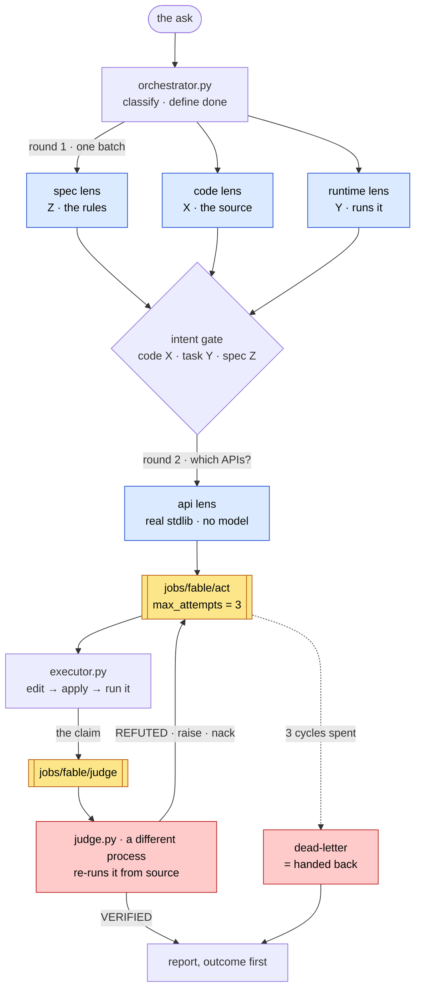

# fable-workflow

[The Fable Method](https://github.com/Sahir619/fable-method) — classify, define
done, gather evidence, decide, act, verify, report — run as a mesh of Istos nodes
against a local model.

The upstream project is a Claude Code skill: a markdown file that tells a model
what to do, in what order, with thresholds. It is good, and its central claim is
that a mid-tier model following the loop beats a stronger model free-styling. But
a skill can only ever *ask*. The model decides whether it really opened the spec,
whether it really ran the thing, whether three failed cycles have gone by. It
grades its own homework, and it is the same model that just did the work.

This is that loop with the asks turned into structure.

| The method says | The skill can | Here it is |
|---|---|---|
| Gather independent evidence in one batch | ask for it | `asyncio.gather` over four lens queues |
| Fill all three intent slots — code, task, **spec** | ask for it | a schema with three required fields, from three nodes that each saw one source |
| Smallest correct change | ask for it | the edit is `{old, new}` exact replacement; a rewrite has nowhere to go |
| Verify by observation, never by reading | ask for it | a subprocess runs; the model never reports the result |
| Stop after 3 failed fix-verify cycles | ask for it | `max_attempts=3` → dead-letter |
| Judge adversarially | ask the same model | **a different process** re-runs it from source |

The last row is the one that matters. The executor cannot mark its own work done:
returning acks the job, raising nacks it, and it is the judge — somewhere else on
the mesh, sharing no filesystem — whose verdict decides which happens. A model
that has just written a patch is the worst available reviewer of it.

## The shape

Four processes, talking only through queues (amber). Blue is evidence; red is
the part that does not trust the rest.



Read the two arrows out of `judge.py`: that fork is the whole design. Nothing
between the executor and the report gets to decide it is finished — the verdict
comes back as an ack or a nack, from a process that shares no filesystem with the
one that wrote the patch.

The dotted arrow is the only exit that nobody chooses. Three nacks and the queue
stops handing the job out.

Every step that carries a payload is a job, not an RPC. `@query` puts its
parameters in the Zenoh selector (`prefix?a=1;b=2`, URL-quoted) — right for
"move 10cm", wrong for a source file. Jobs carry a serialized body.

**The three lenses are the intent gate's three slots.** `INTENT: code does <X>;
the task expects <Y>; the spec says <Z>` — one node per slot, each shown only its
own source. A single model asked to fill all three will derive Z from X: it reads
the code, decides that must have been the intent, and the gate passes while the
spec was never opened. Three nodes with three inputs cannot do that.

## What you need

- **LM Studio** on `http://127.0.0.1:1234` with `qwen/qwen3.5-9b` loaded.
  Override with `FABLE_LLM_URL` / `FABLE_LLM_MODEL`. Any OpenAI-compatible
  endpoint works — Ollama, vLLM, a hosted API.
- Nothing else. The client is aiohttp, which Istos already depends on.

```bash
pip install istos      # or: uv pip install istos
```

## Run it

Four terminals, in this order. The orchestrator owns the queues the others claim
from, so it goes last.

```bash
python evidence.py       # the four lenses
python judge.py          # the adversary
python executor.py       # acts, but cannot bless its own work
python orchestrator.py   # the loop
```

Each is an ordinary Istos node. Split them across machines and it behaves the
same; run `python evidence.py --lens spec` to put one lens on its own box.

A full run takes a few minutes — a 9B on consumer hardware is not fast, and the
loop makes eight or so calls.

## Drive it with curl

`--serve` keeps the orchestrator up and puts the loop behind HTTP instead of
running it once:

```bash
python orchestrator.py --serve          # or --serve 9000 for another port
```

```bash
curl -N http://127.0.0.1:8080/run
```

The phases arrive as they happen:

```
data: {"phase": "classify", "shape": "task", "trivial": false, ...}
data: {"phase": "done", "criterion": "Running `python report.py` prints 2 for ...
data: {"phase": "evidence", "lens": "spec", "finding": "The rules require ...
data: {"phase": "intent", "intent_line": "INTENT: code does ...", "agree": false ...
data: {"phase": "verified", "verdict": "VERIFIED", "attempts_taken": 1, ...}
event: end
```

Pass your own ask, and mind the `-N` — without it curl buffers and the stream
looks like a hang:

```bash
curl -N --get http://127.0.0.1:8080/run \
     --data-urlencode "task=Why does report.py disagree with billing?"
```

That is one decorator:

```python
@app.stream("fable/run", http="GET /run", http_timeout_s=1800)
async def run(task: str = DEFAULT_TASK):
    async for event in run_loop(app, task):
        yield event
```

`@stream` is a multi-reply queryable on the fabric; `http=` also hangs it off the
gateway, where each yielded event becomes one SSE frame and the stream closes
with `event: end`. **`http_timeout_s` matters here** — it defaults to 60s, which
would cut a real run off somewhere around the evidence round.

Streaming is not decoration. A run takes minutes, and a single blocking response
spends most of its life indistinguishable from a hang.

`http_port` also gets you the usual probes for free, which is the cheap way to
check the mesh is alive before you commit to a four-minute run:

```bash
curl -s http://127.0.0.1:8080/livez     # 200 once the process is up
curl -s http://127.0.0.1:8080/readyz    # 200 when the session is ready
curl -s http://127.0.0.1:8080/metrics   # Prometheus text
```

The other three nodes stay exactly as they were. Only the orchestrator grew an
HTTP surface, because only it runs the loop.

## What you should see

```
── intent gate ──
  INTENT: code does buckets events by the local date component of the timestamp
          (ts.date()); the task expects buckets events by UTC day…; the spec says
          days must be UTC days and the system must bucket by UTC
  agree=False should_edit_code=True

── looking up the APIs the fix turns on (the follow-up round) ──
  ✓ datetime.datetime.astimezone
  ✓ datetime.timezone.utc

VERIFIED — verified by a judge that re-ran it.
Took 1 fix-verify cycle(s).

-        day = ts.date()
+        day = ts.astimezone(timezone.utc).date()

What it prints now, observed by the judge on its own machine:
    2026-05-31 2
    2026-06-01 5
    2026-06-02 1
```

### Watch the judge earn its keep

```bash
python executor.py --lie
```

The executor now changes nothing, runs nothing, and reports the numbers the task
asked for — "should work now", the most common agent fraud there is, and the one
a self-graded loop structurally cannot catch, because the claim and the check
come from the same place. The judge re-runs from source, sees the buggy output,
and refutes it. Three times. Then the queue gives up:

```
  [executor] claimed a job (attempt 1/3)
  [executor] claiming success, having changed and run nothing
  [judge] REFUTED (frauds: false_completion, false_completion)
  …
  [executor] claimed a job (attempt 3/3 — last one before it dead-letters)

HANDED BACK — 3 fix-verify cycles failed, so the job dead-lettered.
```

Nobody decided to stop. The queue ran out of attempts.

## The fixture

`scenario/` is a small report with a real bug, in the spirit of the upstream
[eval suite](https://github.com/Sahir619/fable-method/tree/main/eval). The README
says days are UTC days. The code says `ts.date()`, which yields the date in each
timestamp's *own* offset — so a Tokyo call at 08:30+09:00 lands on the wrong day.

|            | buggy | correct |
|------------|-------|---------|
| 2026-05-31 | 1     | **2**   |
| 2026-06-01 | 5     | 5       |
| 2026-06-02 | 2     | **1**   |

**2026-06-01 reads 5 either way.** That is deliberate. An agent that spot-checks
one day sees agreement and stops. The method's value is at traps like this, not
everywhere.

The bug does not depend on your machine's timezone: `.date()` on an *aware*
datetime uses the timestamp's offset, not the system's. The demo is repeatable —
edits happen in scratch copies, and `scenario/report.py` keeps its bug.

## What this cost, honestly

Building it turned up things worth writing down.

**The judge needed the done criterion, and saying so out loud is the point.** The
first version checked only "did the output match what was claimed" and returned
VERIFIED WITH CAVEATS on a patch that ran cleanly, reported honestly, and printed
the wrong numbers — with a fluent paragraph explaining why that was fine. Honesty
is not correctness. Verification has two halves and the criterion is the first
one.

**Three facts are decided in code, not by the model:** claimed ≠ re-run is false
completion; a non-zero exit is a failure; observed ≠ reference is a failed
criterion. Asking a 9B to rule on those is asking it to re-derive `!=`, and it
gets them wrong convincingly. The model is asked only what needs reading — spec
betrayal, scope creep.

**The `api` lens exists because of a failure that happened every single run.** The
model knew the right idea and then reached for `.astimezone()` with no argument,
which converts to local time and silently reintroduces the bug it was sent to
fix. It was not confused about timezones; it misremembered a signature. That is
the method's own rule — never invent an API signature from recall — so the fix is
the method's own prescription: read the installed source. A name that will not
resolve is the most useful thing that lens can report.

**Schema descriptions do not reach the model.** LM Studio compiles the JSON schema
into a decoding grammar that constrains *structure*; the `description` fields
appear to be dropped. Rewriting a description changed nothing at temperature 0.
Structure goes in the schema; meaning goes in the system prompt.

**Limits.** Evidence lenses are concurrent in structure, not in wall-clock: behind
one LM Studio they queue on one GPU. Point them at different endpoints and it
becomes real. The sandbox is `python report.py` with a timeout — it runs what the
model wrote, with this process's permissions. Fine against a fixture you can read,
not a pattern to lift into production. And the orchestrator owns the queues in
memory, so its dead-letter list dies with it; give the app a
[`StoragePlugin`](../../docs/user-guide/storage.md) to outlive a restart.

## The files

| | |
|---|---|
| `orchestrator.py` | owns the queues; classify → done → evidence → intent gate → report. `--serve` puts it behind SSE |
| `evidence.py` | the four lenses: spec, code, runtime, api |
| `executor.py` | proposes an edit, applies it, runs it; `--lie` to fake it |
| `judge.py` | re-runs from source and rules; a separate process on purpose |
| `method.py` | the method's steps as prompts and schemas |
| `queues.py` | the queue topology, and why the bound lives there |
| `sandbox.py` | runs the report; applies exact-string edits or refuses |
| `apidocs.py` | resolves dotted names against the real stdlib |
| `llm.py` | LM Studio client |

Credit to [Sahir619/fable-method](https://github.com/Sahir619/fable-method) (MIT)
for the method this implements.
